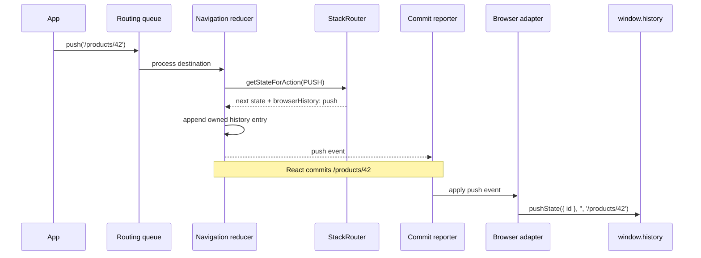
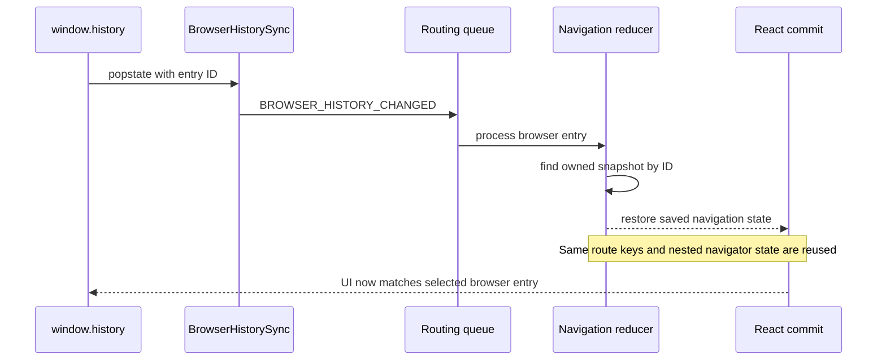

# How This PR Aligns Expo Router With Browser History

This document explains the current PR from first principles. It is intended for readers who know React Navigation or Expo Router at a high level, but have not worked on this part of the codebase.

## Executive summary

Expo Router maintains two related histories on web:

1. **Navigation state** — the nested stack, tab, and drawer state managed by React Navigation.
2. **Browser history** — the entries managed by `window.history`, which drive the browser Back and Forward buttons.

Those histories must describe the same user-visible sequence. If Expo Router thinks the previous screen is `/details`, while the browser thinks it is `/explore`, `router.back()` and the browser Back button behave differently.

This PR makes three structural changes:

1. It moves browser-history bookkeeping into the same reducer transaction that changes navigation state.
2. It lets the router that understands an action decide whether that action means **push**, **replace**, or **pop** for browser history.
3. It applies browser side effects only after React commits the corresponding navigation state.

The short mental model is:

> **The router decides, the reducer records, and the browser adapter executes.**

That division is the central idea behind the PR.

---

## Table of contents

1. [The problem](#the-problem)
2. [A small glossary](#a-small-glossary)
3. [Why the old approach was fragile](#why-the-old-approach-was-fragile)
4. [The new architecture](#the-new-architecture)
5. [How an ordinary push works](#how-an-ordinary-push-works)
6. [How the two-push example works](#how-the-two-push-example-works)
7. [How browser Back works](#how-browser-back-works)
8. [What each router decides](#what-each-router-decides)
9. [Nested routers and parent overrides](#nested-routers-and-parent-overrides)
10. [Why a pop includes a target](#why-a-pop-includes-a-target)
11. [Prevented navigation](#prevented-navigation)
12. [Suspense and concurrent rendering](#suspense-and-concurrent-rendering)
13. [Reloads, deep links, and unknown entries](#reloads-deep-links-and-unknown-entries)
14. [Web and native queue behavior](#web-and-native-queue-behavior)
15. [File-by-file guide](#file-by-file-guide)
16. [Test coverage](#test-coverage)
17. [Known limitations](#known-limitations)
18. [Suggested review order](#suggested-review-order)

---

## The problem

Consider this code:

```ts
router.push('/(tabs)/explore/details');
router.push('/(tabs)/explore/final');
```

The intended user-visible history is:

```text
... -> details -> final
```

From `final`:

- `router.back()` should go to `details`.
- The browser Back button should also go to `details`.
- The browser Forward button should then return to `final`.

This sounds simple, but Expo Router state is a nested tree. A typical application might contain:

```text
Root stack
└── Tabs
    ├── Home stack
    └── Explore stack
        ├── index
        ├── details
        └── final
```

An action can change several levels of that tree at once. It can also:

- focus a different tab;
- add or remove a stack route;
- promote an existing singular route instead of increasing the stack length;
- open or close a drawer without changing the URL;
- be rejected by a `beforeRemove` handler;
- suspend while React waits for code or data;
- reach a navigator that has not mounted yet.

The browser only sees a linear list of entries. Expo Router therefore needs a deliberate translation from a nested navigation action to a browser-history operation.

---

## A small glossary

| Term | Meaning in this PR |
| --- | --- |
| **Navigation state** | The React Navigation state tree containing stacks, tabs, drawers, route keys, indexes, and nested child state. |
| **Router** | The object that understands a navigator's actions. Examples are `StackRouter`, `TabRouter`, and `DrawerRouter`. |
| **Reducer** | The pure code that applies an action to the navigation tree and computes the next internal browser-history state. |
| **Browser entry** | One item in `window.history`, visited with browser Back or Forward. |
| **Owned entry** | A browser entry created or claimed by this Expo Router session and identified by an Expo Router entry ID. |
| **Report event** | A description of a browser side effect that the reducer emits for execution after React commits. |
| **Adapter** | The only layer that calls `window.history.pushState`, `replaceState`, or `go`. |

Two details are especially useful when reading the code:

1. The reducer stores full navigation snapshots in memory so it can restore exact route keys and nested state.
2. `window.history.state` stores only a small Expo Router entry ID. The full navigation tree is not serialized into the browser.

---

## Why the old approach was fragile

Before this work, browser synchronization lived mainly in linking code. The implementation observed navigation changes and tried to infer what the browser should do from the resulting state.

The original version of this PR improved that design by deriving browser history in the navigation-tree reducer. The rework goes one step further: it moves the **decision** about the meaning of an action into the router that handled it.

### State shape does not always reveal user intent

A stack length increasing often means “push,” but that is not a complete rule.

Examples:

- A singular route can be moved to the top without changing the stack length. It is still a new user-visible visit and should push a browser entry.
- A tab router can deduplicate an earlier tab-history item. The history array length may stay the same even though the user made a new visit.
- Opening a drawer can be a history entry even when the URL is unchanged.
- A structural state repair can change part of the state tree without representing navigation that belongs in browser history.

Comparing state before and after the action loses the reason that the state changed. The router still has that reason because it understands the action.

### The final state is too late to recover intermediate visits

If two pushes are queued together, observing only the final committed state can collapse them into one browser entry.

The hardest form of this bug happens when the first push targets a navigator that is not mounted yet:

```ts
router.push('/(tabs)/explore/details');
router.push('/(tabs)/explore/final');
```

When both destinations are processed before the Explore stack has mounted and registered itself, the parent tab router can handle both resolutions. The intermediate `details` visit never becomes a committed Explore-stack transition, so browser history cannot faithfully record it.

The fix requires both a better history policy and a web queue that allows one destination to commit before resolving the next one.

---

## The new architecture

The implementation separates policy, pure state calculation, and browser side effects.

```mermaid
flowchart LR
    A[router.push / router.back / browser popstate]
    B[Routing queue]
    C[Navigation-tree reducer]
    D[Stack, Tab, or Drawer router]
    E[RouterActionResult.browserHistory]
    F[Internal BrowserHistory projection]
    G[Committed report event]
    H[Browser-history adapter]
    I[window.history]

    A --> B
    B --> C
    C --> D
    D --> E
    E --> F
    F --> G
    G -->|after React commit| H
    H --> I
```



### 1. The router decides the history meaning

The router action result can carry this metadata:

```ts
type RouterBrowserHistoryAction =
  | { type: 'push' }
  | { type: 'replace' }
  | {
      type: 'pop';
      count: number;
      target?: {
        navigatorKey: string;
        routeKey: string;
      };
    };
```

The metadata describes the semantic result of the action. It does not call the browser directly.

### 2. The reducer projects that decision into internal history

The reducer owns an in-memory `BrowserHistory` alongside navigation state. Each entry contains:

```ts
{
  id: string;
  path: string;
  state: NavigationState;
}
```

The state also tracks the current entry index and the sequence used to create unique IDs.

Given the router's instruction, the reducer computes the next internal history and emits a report event such as:

```ts
{ op: 'push', entryId, path }
{ op: 'replace', entryId, path }
{ op: 'go', delta }
```

This part is pure: it calculates data without touching `window.history`.

### 3. React commits navigation state

The report-event consumer runs only for committed state. This matters because React may render a transition and later discard it.

### 4. The adapter changes the browser

After the commit, the browser adapter executes the event with:

- `window.history.pushState`;
- `window.history.replaceState`; or
- `window.history.go`.

The adapter also serializes asynchronous `history.go` operations and ignores the `popstate` event produced by its own command.

---

## How an ordinary push works

Suppose the app is displaying `/products` and calls:

```ts
router.push('/products/42');
```

The flow is:



The browser side effect cannot get ahead of the UI because it happens after the navigation result commits.

---

## How the two-push example works

Return to the motivating example:

```ts
router.push('/(tabs)/explore/details');
router.push('/(tabs)/explore/final');
```

Assume the app starts on the Home tab and the Explore stack has not mounted.

### Step 1: enqueue both destinations

Both calls enter the routing queue in order. Each queued intent gets its own stable identity, even if callers reuse the same object.

### Step 2: process only the first destination

On web, the queue drainer processes one destination for the current committed transition.

The first destination focuses Explore and navigates to `details`.

### Step 3: commit `details`

React commits the Explore branch. Its stack router mounts and registers. The reducer records a browser-history push for `details`, and the adapter creates the browser entry.

### Step 4: process the second destination

Only after that committed transition does the web drainer process `final`.

Now the Explore `StackRouter` is available to handle the action. It pushes `final` onto its navigation stack and explicitly reports a browser-history push.

### Step 5: commit `final`

React commits `final`, and the adapter creates the second browser entry.

The result is:

| Position | Navigation meaning | Browser URL |
| ---: | --- | --- |
| 1 | Earlier page | previous URL |
| 2 | Explore details | `/explore/details` |
| 3 | Explore final | `/explore/final` |

Both back mechanisms now select entry 2.

This behavior has a dedicated Playwright test using the exact synchronous call sequence.

---

## How browser Back works

Browser Back begins outside React Navigation, so the direction is reversed.



For an entry owned by the current session, the reducer restores the saved navigation snapshot. It does not reconstruct the state only from the URL.

That distinction preserves details that a URL cannot express, including nested navigator history and route identity. The end-to-end coverage also verifies that a restored nested route does not remount in the tested scenario.

If a removal guard prevents the restore, Expo Router keeps the current navigation state and moves the browser back to the matching current entry.

---

## What each router decides

### StackRouter

The stack router understands stack actions and their intended history semantics.

| Action/result | Browser-history decision |
| --- | --- |
| `PUSH` that changes the focused route | Push |
| `NAVIGATE` to a different focused route | Push |
| Promote an existing singular route | Push |
| Update the current route without a new visit | Refresh/replace current entry |
| `GO_BACK` | Pop |
| `POP` | Pop by the requested stack distance |
| `POP_TO` | Pop to the matching route |
| `POP_TO_TOP` | Pop to the first route |
| Preload or structural repair | No new entry; refresh current entry if needed |

The singular-route case shows why router-owned policy matters. A route can move to the top while the number of routes stays constant. State-length inference would miss the push.

### TabRouter

Tab history can deduplicate an older visit. A new visit is still a browser push even if the tab history's length does not increase.

For `history` and `fullHistory` back behavior:

- a new visit reports `push`;
- `GO_BACK` reports `pop` with a target;
- a state refresh that is not a new visit replaces the current browser snapshot.

### DrawerRouter

A drawer can open and close without changing the URL. Those transitions can still matter to Back behavior.

One subtle case is child navigation while the drawer is open. The child action might normally push, but the same transition also closes the drawer. The drawer router can return an explicit `replace`, consuming the drawer-open entry so the earlier page remains the next Back destination.

### Custom routers

The router result contract is public enough for custom routers to provide the same metadata. Tests verify that a custom router's explicit decision wins even when its state shape would suggest something else.

---

## Router instructions at a glance

| Router instruction | Internal effect | Browser effect after commit |
| --- | --- | --- |
| `{ type: 'push' }` | Append an owned snapshot and discard the forward branch | `pushState` |
| `{ type: 'pop', ... }` | Select an earlier owned snapshot | `history.go(delta)` when browser movement is needed |
| `{ type: 'replace' }` | Refresh the current owned snapshot | `replaceState` |
| No instruction | Treat as a state refresh rather than a new visit | `replaceState` when the current entry needs updating |

An explicit `replace` and an omitted instruction can produce the same browser operation. The explicit form is still meaningful while nested router results are composed: a parent router can deliberately override a child's `push`.

---

## Nested routers and parent overrides

An action often starts in a child navigator and then changes how its ancestors are focused.

For example:

```text
Root stack
├── Main tabs
│   └── Child stack
└── Modal
```

A child action may push a route inside `Main tabs`, while focusing that child also removes or replaces the parent modal route.

`reduceNavigationTree` carries the child router's browser instruction while it rebuilds the ancestor path. At each ancestor, the router may provide a focus-history decision. A parent can therefore replace the child's instruction when the outer navigation semantics require it.

This keeps the policy near the router that understands the affected navigator instead of embedding special cases in the browser-history projector.

---

## Why a pop includes a target

A pop contains both a count and, when available, a target route identity:

```ts
{
  type: 'pop',
  count: 1,
  target: {
    navigatorKey,
    routeKey,
  },
}
```

The count describes movement in one navigator. It is not always the same as the browser delta.

Consider:

```text
/a
/b/index
/b/details
```

A parent navigator may report “pop one route” to return from the `/b` branch to `/a`. The browser must move back two entries.

The reducer uses the target navigator and route keys to search saved browser snapshots along their focused branches. It can then find the actual owned entry containing the target and calculate the correct browser delta.

This is another reason the browser layer stores full navigation snapshots internally instead of keeping only URLs.

---

## Prevented navigation

React Navigation can prevent a route from being removed, for example when a form has unsaved changes.

History instructions are applied only after the navigation action has been accepted.

If removal is prevented:

1. The navigation state remains unchanged.
2. No speculative browser push or pop is committed.
3. If the trigger was browser Back, the browser is corrected to the entry matching the still-visible UI.

This keeps the address bar, browser position, and navigation tree consistent after cancellation.

---

## Suspense and concurrent rendering

React may begin a transition that never commits.

Example:

1. The app starts on `/first`.
2. A push to `/third` begins.
3. `/third` suspends before commit.
4. The user presses browser Back.

The reducer may already have calculated speculative state for `/third`, but the browser must not receive a delayed `/third` push after Back has restored `/first`.

To handle this, browser-history change intents carry the last committed `NavigationTreeResult`. Before restoring the selected browser entry, the reducer resets speculative navigation state, browser history, and pending reports to that committed snapshot. It preserves the monotonic event sequence so event identities are never reused.

The result is simple from the user's perspective: abandoned renders do not leak browser commands.

---

## Reloads, deep links, and unknown entries

The browser can report entries that the current in-memory session does not recognize.

### Known owned ID

If the entry ID exists in the reducer's owned history, Expo Router restores its exact saved navigation state.

### No Expo Router ID

For an unowned entry, Expo Router parses the current URL or hash into navigation state and claims the browser entry with a new ID.

### Old ID after reload

After a full reload, `window.history` may still contain an ID from the previous JavaScript session, while the new reducer has no saved snapshot for it. The entry is treated as unknown, parsed from its URL, and becomes the starting point for a new owned history list.

### Anchored deep links

The tests cover anchored stacks where a deep link creates an expected parent route below the linked route. They also cover reloading that deep link and navigating back afterward.

---

## Web and native queue behavior

The queue drainer now has platform-specific implementations.

### Web

[`RoutingQueueDrainer.tsx`](./packages/expo-router/src/global-state/RoutingQueueDrainer.tsx) processes one destination per committed transition.

This allows a newly focused navigator to mount and register before the next queued destination is resolved. It is what preserves both entries in the unmounted Explore-stack example.

### Native

[`RoutingQueueDrainer.native.tsx`](./packages/expo-router/src/global-state/RoutingQueueDrainer.native.tsx) keeps the existing batched behavior.

Native platforms do not have browser history, so changing their commit cadence would add risk without helping this feature. The native browser-history modules are no-ops.

---

## File-by-file guide

### Router contract and policies

- [`react-navigation/routers/types.tsx`](./packages/expo-router/src/react-navigation/routers/types.tsx) defines `RouterBrowserHistoryAction`, adds browser-history metadata to router results, and defines the optional focus-history hook.
- [`StackRouter.tsx`](./packages/expo-router/src/react-navigation/routers/StackRouter.tsx) maps stack actions to push, pop, replace, or refresh behavior.
- [`TabRouter.tsx`](./packages/expo-router/src/react-navigation/routers/TabRouter.tsx) handles tab visits, deduplication, and tab back history.
- [`DrawerRouter.tsx`](./packages/expo-router/src/react-navigation/routers/DrawerRouter.tsx) handles same-URL drawer entries and parent overrides.
- [`layouts/stack-router.ts`](./packages/expo-router/src/layouts/stack-router.ts) preserves the history instruction through Expo Router's stack wrapper.

### Pure navigation and browser-history state

- [`reduceNavigationTree.ts`](./packages/expo-router/src/global-state/reduceNavigationTree.ts) applies navigation actions, propagates router decisions through ancestors, and observes prevented removals.
- [`browserHistoryTypes.ts`](./packages/expo-router/src/global-state/browserHistoryTypes.ts) contains the serializable internal types and report-event shapes.
- [`browserHistory.ts`](./packages/expo-router/src/global-state/browserHistory.ts) projects router instructions into owned browser-history snapshots. It also restores known entries and resolves pop targets.
- [`useNavigationTreeReducer.ts`](./packages/expo-router/src/global-state/useNavigationTreeReducer.ts) keeps navigation state, internal browser history, and report events in one reducer result.

### Browser integration

- [`browserHistoryAdapter.ts`](./packages/expo-router/src/global-state/browserHistoryAdapter.ts) is the side-effect boundary around `window.history`.
- [`BrowserHistorySync.tsx`](./packages/expo-router/src/global-state/BrowserHistorySync.tsx) listens for `popstate` and sends browser changes into the routing queue.
- [`useNavigationTreeReportEvents.ts`](./packages/expo-router/src/global-state/useNavigationTreeReportEvents.ts) applies report events after commit and prunes completed events.
- [`browserHistory.native.ts`](./packages/expo-router/src/global-state/browserHistory.native.ts) and the native adapter make browser synchronization inert on native.

### Queueing and transition ordering

- [`routingQueueContext.tsx`](./packages/expo-router/src/global-state/routingQueueContext.tsx) stores queued intents with stable per-enqueue identity and lets cancellation supersede pending destinations.
- [`RoutingQueueDrainer.tsx`](./packages/expo-router/src/global-state/RoutingQueueDrainer.tsx) enforces one committed destination at a time on web.
- [`RoutingQueueDrainer.native.tsx`](./packages/expo-router/src/global-state/RoutingQueueDrainer.native.tsx) retains native batching.

### Removed responsibility

- [`useLinking.ts`](./packages/expo-router/src/fork/useLinking.ts) now seeds initial navigation from the URL but no longer owns the ongoing browser-history synchronization algorithm.
- The previous custom memory-history implementation was removed because the reducer now owns the canonical in-memory history.

---

## Test coverage

The tests are split by responsibility.

### Router unit tests

These verify that each router reports the correct semantic decision:

- stack push, pop, preload, and replacement behavior;
- singular-route promotion;
- tab history and deduplicated revisits;
- drawer open/close behavior, including child navigation while open;
- custom-router decisions.

### Browser-history projection tests

These cover:

- claiming the initial browser entry;
- pushes and forward-history truncation;
- pops, clamping, and replacement;
- route identity and structural refreshes;
- known-entry restoration;
- redirects and prevented removals;
- hashes and unknown entry IDs;
- nested pop-target resolution.

### Reducer and queue tests

These cover:

- initial replacement and subsequent pushes;
- multiple queued pushes;
- report-event pruning;
- parent router overrides;
- resetting speculative state to the last committed snapshot;
- FIFO ordering, Strict Mode, errors, repeated object inputs, and suspended-navigation cancellation;
- committing each web destination before processing the next one.

### Browser end-to-end tests

The Chromium suite contains eight scenarios:

1. ordinary Back and Forward;
2. rapid history traversal;
3. one browser entry per batched push;
4. alignment between `router.back()` and browser Back;
5. the exact two-push example into a previously unmounted Explore stack;
6. Back behavior for an anchored deep link;
7. retaining the anchor through reload;
8. restoring nested stack state without remounting in the tested flow.

### Validation result

- All 8 Chromium browser-history scenarios pass.
- Build, TypeScript, and lint checks pass.
- The Expo Router package run passes 420 suites and 5,366 tests, with 9 skipped.
- Three unrelated React Server Component asset snapshots fail because a linked dependency transformer encodes the worktree-relative path. They are outside the browser-history code changed here.

---

## Known limitations

### History from before this JavaScript session

After a reload, the new session cannot recover full navigation snapshots that existed only in the old session's memory. It reconstructs unknown entries from their URLs.

### Browser and navigator histories are different data structures

Some router operations deduplicate or promote routes. Older browser snapshots can still exist even after their corresponding route is removed from the navigator's current history array.

The PR covers immediate Back alignment and popping to surviving route identities. It cannot guarantee a permanent one-to-one mapping after every possible sequence of deduplication and then traversing far back into old browser snapshots.

### Same-URL entries need semantic information

URLs alone cannot distinguish states such as an open and closed drawer. The design handles these while the session owns the entries because it stores navigation snapshots internally. That distinction cannot be reconstructed from the URL alone after a reload.

---

## Suggested review order

For the quickest path through the PR:

1. Read the router contract in [`types.tsx`](./packages/expo-router/src/react-navigation/routers/types.tsx).
2. Read the `StackRouter` decisions and their tests.
3. Read [`reduceNavigationTree.ts`](./packages/expo-router/src/global-state/reduceNavigationTree.ts) to see how child and parent decisions are composed.
4. Read [`browserHistory.ts`](./packages/expo-router/src/global-state/browserHistory.ts) to see how decisions become owned entries and browser deltas.
5. Read [`useNavigationTreeReducer.ts`](./packages/expo-router/src/global-state/useNavigationTreeReducer.ts) and [`useNavigationTreeReportEvents.ts`](./packages/expo-router/src/global-state/useNavigationTreeReportEvents.ts) to understand the pure-reducer/committed-side-effect boundary.
6. Read the web queue drainer and its tests for the previously unmounted navigator case.
7. Finish with the Playwright scenarios to see the behavior from a user's perspective.

## Final takeaway

The PR does more than move calls to `window.history`. It establishes one coherent transaction:

1. A router interprets an action.
2. The navigation tree and its matching browser-history projection are calculated together.
3. React commits the navigation state.
4. The browser receives the corresponding command.
5. Browser traversal restores the saved navigation snapshot through the same queue and reducer.

That is what keeps `router.back()`, browser Back, nested navigator state, prevented transitions, and concurrent rendering aligned.
