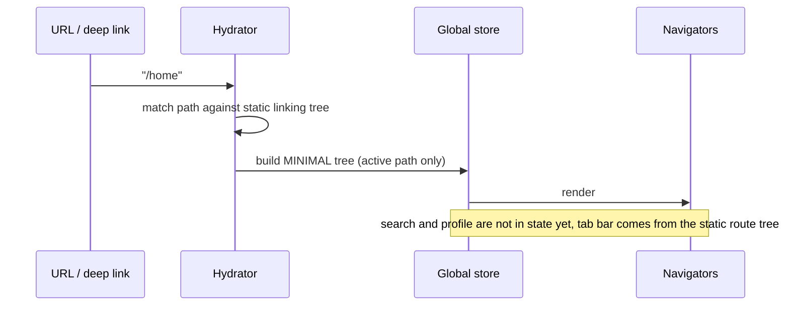
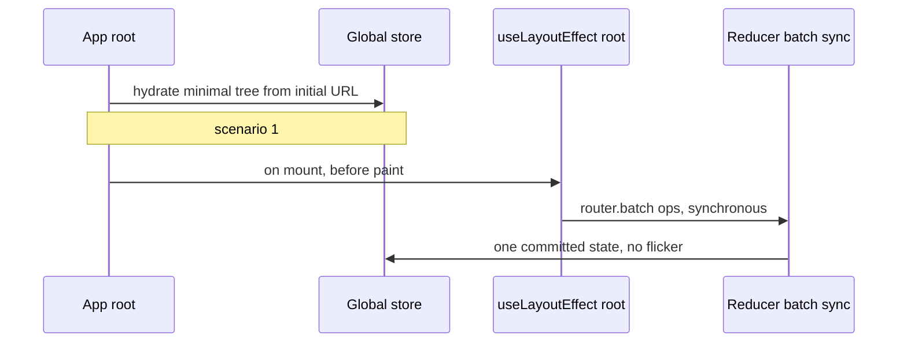
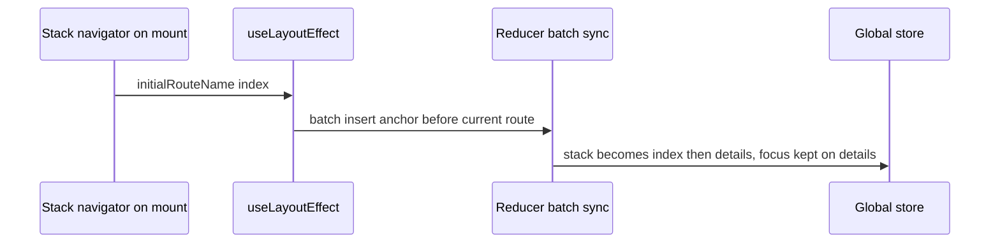
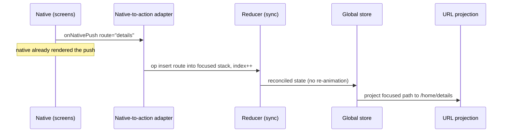
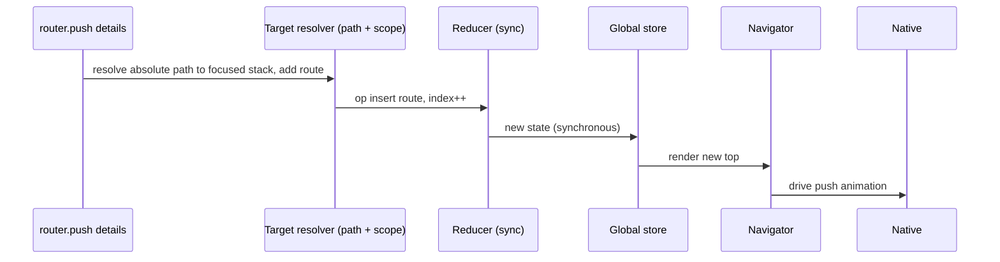
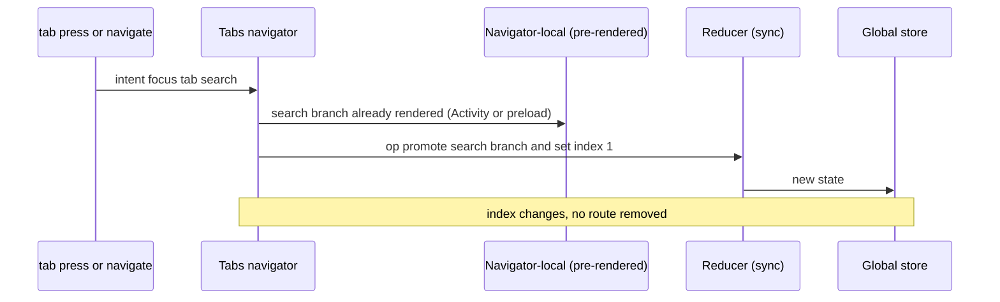
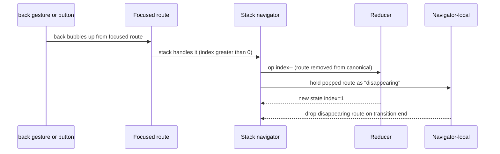
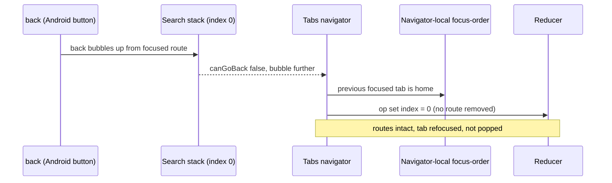

# 🧭 Summary & review (Claude)

> Source: [Notion — Router v57 / New state model / Summary & review (Claude)](https://app.notion.com/p/381e5b573524813b8e1fcca52714542b)

## Scenarios — dispatch flow + JSON state

> 🧩 All examples use one app: a **Tabs** root with `home` / `search` / `profile`, each hosting a **Stack**. Nodes are homogeneous — `{ key, routes, index }` — so the same shape appears at every level. Inactive tabs are absent from *global* state until promoted (decision D1/D11); the tab bar itself is rendered from the static route tree, not from state.

### 1. Creation of the initial state



**State after hydration** (URL `/home`):

```json
{
  "root": {
    "key": "root",
    "index": 0,
    "routes": [
      {
        "key": "home#0",
        "name": "home",
        "child": {
          "key": "home.stack",
          "index": 0,
          "routes": [ { "key": "index#0", "name": "index" } ]
        }
      }
    ]
  }
}
```

### 1b. Seeding initial state beyond the URL (global + local)

The URL only ever hydrates the *minimal active path* (scenario 1). Anything richer — a global starting arrangement, or a navigator's own anchor/initial routes — is seeded with **batched operations that run synchronously in `useLayoutEffect`**, before first paint, so there is no visible flash of the un-seeded tree. Reuses `router.batch` (see C13) with `animation: none`.

Two entry points:

- **Global initial state** — initial URL **plus** a root `useLayoutEffect` that dispatches one batch. The URL is the canonical seed; the batch adds what the URL can't express (preloading inactive tabs, a custom starting layout). Synchronous by design.
- **Local initial state (from a navigator)** — a navigator declares its own initial routes (e.g. a stack's `initialRouteName` anchor). Navigators never mutate state inline, so the navigator seeds itself on mount via a batched op. Classic case: deep-linking straight to `/home/details` should still leave `index` underneath so back works.

**Global** — root seeds after URL hydration:



**Local** — a stack anchors itself on mount:



**Before** — deep link `/home/details` hydrates only `details`

```json
{
  "key": "home.stack",
  "index": 0,
  "routes": [
    { "key": "details#0", "name": "details" }
  ]
}
```

**After** — navigator's batched seed inserts the `index` anchor (focus preserved)

```json
{
  "key": "home.stack",
  "index": 1,
  "routes": [
    { "key": "index#anchor", "name": "index" },
    { "key": "details#0", "name": "details" }
  ]
}
```

### 2. Navigation action dispatch — native

> This scenario is only possible for preloaded routes - native can only push the preloaded route in stack, so it has a way to signal that it appeared (via events)

Native has **already animated** the change (e.g. link-preview commit, native push). The adapter reconciles state *after the fact* — the reducer must not re-trigger an animation.



**Before** — focused `home.stack`

```json
{
  "key": "home.stack",
  "index": 0,
  "routes": [
    { "key": "index#0", "name": "index" }
  ]
}
```

**After** — `details` pushed (`index++`)

```json
{
  "key": "home.stack",
  "index": 1,
  "routes": [
    { "key": "index#0", "name": "index" },
    { "key": "details#1", "name": "details", "params": { "id": "42" } }
  ]
}
```

### 3. Navigation action dispatch — js

`router.push("/home/details?id=42")`. Same end state as the native case, but the **order is reversed**: state changes first (synchronously), then the navigator drives the animation.



**Resulting `home.stack`** — identical canonical state to scenario 2's *After*:

```json
{
  "key": "home.stack",
  "index": 1,
  "routes": [
    { "key": "index#0", "name": "index" },
    { "key": "details#1", "name": "details", "params": { "id": "42" } }
  ]
}
```

### 4. Tab change dispatch

> All tabs render in advance — they are stored in local state first and added to global state on the navigation action.

Switching from `home` to `search`. Per the rendering model, **all tabs render in advance**: each tab's branch is held in **navigator-local** state and only **promoted into global state on a navigation action**. A `lazy` prop opts a tab into React `Activity` (mounted but deferred); a tab that is **not** lazy is **preloaded** so global state stays correctly represented. Switching is then just **set `index`** on the tabs node — the target branch already exists. No route is removed; the `home` branch and its history are retained.

**Cross-tab navigation in global actions** (answering the comment): a plain tab switch is `set index`. Navigating to a *deep path* in another tab (e.g. `/b/z` → `/a/x/y`) is a **batch**: `set index` to `a` **and** apply the in-tab nav op inside `a`'s child stack, committed at once.



**Before** — root global state, only `home` promoted

```json
{ "key": "root", "index": 0, "routes": [
  { "key": "home#0", "name": "home", "child":
    { "key": "home.stack", "index": 0, "routes": [ { "key": "index#0", "name": "index" } ] } }
] }
```

**After** — `search` promoted from local and focused (`index = 1`)

```json
{ "key": "root", "index": 1, "routes": [
  { "key": "home#0", "name": "home", "child":
    { "key": "home.stack", "index": 0, "routes": [ { "key": "index#0", "name": "index" } ] } },
  { "key": "search#1", "name": "search", "child":
    { "key": "search.stack", "index": 0, "routes": [ { "key": "index#0", "name": "index" } ] } }
] }
```

### 5. Back action in stack

`home.stack` is `[index, list, details]` at `index = 2`. Back bubbles up from the focused route; the stack handles it (`canGoBack` because index is greater than 0) and maps it to **remove + index--**. The popped route drops to **navigator-local** state until the animation finishes.



**Before** — `home.stack` at `details` (`index = 2`)

```json
{ "key": "home.stack", "index": 2, "routes": [
  { "key": "index#0", "name": "index" },
  { "key": "list#1", "name": "list" },
  { "key": "details#2", "name": "details" }
] }
```

**After** — popped (`index--`)

```json
{ "key": "home.stack", "index": 1, "routes": [
  { "key": "index#0", "name": "index" },
  { "key": "list#1", "name": "list" }
] }
```

Navigator-local (ephemeral, **not** in global state):

```json
{ "disappearing": [ { "key": "details#2", "name": "details" } ] }
```

### 6. Back action in tabs

Focused tab is `search`, whose stack is already at root (`canGoBack = false`). Back bubbles past the stack up to the Tabs navigator, which consults **navigator-local focus-order** and refocuses the previous tab. `routes` are **unchanged** — a tab is refocused, never popped. This is the concrete contrast with scenario 5 (see C12).



**Before** — root, focused tab `search` (`index = 1`)

```json
{ "key": "root", "index": 1, "routes": [
  { "key": "home#0", "name": "home", "child":
    { "key": "home.stack", "index": 0, "routes": [ { "key": "index#0", "name": "index" } ] } },
  { "key": "search#1", "name": "search", "child":
    { "key": "search.stack", "index": 0, "routes": [ { "key": "index#0", "name": "index" } ] } }
] }
```

**After** — `index` back to `home`, `routes` unchanged

```json
{ "key": "root", "index": 0, "routes": [ /* unchanged */ ] }
```

The focus-order that drives it lives in navigator-local state:

```json
{ "focusOrder": ["home", "search"] }
```

If no focus-order is kept, the back-bubbling contract falls through to "no handler, screens decide / exit app".

## Proposed state shape (tree)

```typescript
// Single root useReducer (React-owned): a homogeneous tree. Every node has the SAME shape —
// there is NO `type: 'stack' | 'tabs'`. How a node renders is decided by the
// component / _layout, not stored in state. "Minimal" = inactive branches are
// absent from GLOBAL state until promoted; a URL hydrates only the active path.
type GlobalNavState = { root: NavNode }

type NavNode = {
  key: string
  routes: RouteEntry[] // tabs OR history OR columns — the renderer decides
  index: number        // the focused route within `routes`
}

type RouteEntry = {
  key: string
  name: string
  params?: object
  child?: NavNode      // nested navigator, if this route hosts one
}

// Interpretation is a RENDERING concern, not a state concern:
//   Stack: routes[0..index] = back history, routes[index] = top.
//          NO forward; preload is navigator-local (decision D6).
//   Tabs:  routes = the promoted tabs, index = active tab.
//   Split: routes = columns, renderer shows several at once.
//
// NOT in global state — navigator-local, lost on restart by design:
//   - disappearing screens still animating out after a pop
//   - drawer open/close
//   - preloaded routes (D6)
//   - all-tabs-pre-rendered branches before promotion (D11)
//   - tab focus-order (Android cross-tab back), if needed
```

## Consolidated summary of the original notes

> Faithful summary of the proposal as written in the notes. Where a decision supersedes a point, see the **Decisions** section at the end.

- **Single global state, modified only via URL-shaped actions** (`navigate`, `goBack`, `goBackTo`, `replace`, `preload`, `reset`). Custom behavior = read the current/local URL and modify it/history.
- **Three target scopes for actions:** absolute, relative, and relative-to-navigator.
- **Navigators are a pure rendering layer** — they render the state they receive, cannot mutate it inline, may hold render-only/ephemeral local state, and translate gestures + native events into primitive reducer operations.
- **Homogeneous state:** no `stack`/`tabs` node types; just `routes` + `index`, interpreted by the renderer.
- **Navigable routes come from linking / local scope.**
- **Stack:** history == browser; closing routes kept rendering locally until screens report they disappeared. Native-originated changes limited to: push-from-link-preview (preloaded only), single pop, multi-level pop, pop-to-top.
- **Tabs:** all tabs render in advance (local), promoted to global state on navigation; the focused tab is the tabs node's `index`. Cross-tab nav in global actions = `set index`, or a `batch` of `set index` + in-tab op for a deep path.
- **Drawer:** navigator-local; explicit drawer actions deprecated (D10).
- **SplitView:** approach to be picked (see C10).
- **Actions to keep:** Navigate, GoBack, GoBackTo, Replace, Preload, Reset.
- **Reset = batching multiple operations**; `router.batch(() => {…})`.
- **Back action:** bubble up from the focused route; navigators handle it, else nothing (screens act).
- **Linking vs layout:** concerns are split (D8).

## Challenges & recommendations

### C10 — SplitView: candidate approaches (pick one)

1. **Homogeneous node, multi-visible** — one node whose renderer shows several `routes` at once; each `RouteEntry` may host a `child` stack. Most consistent with D5.
2. **Parallel children with a visible-set** — node carries `index` plus a renderer-honored `visible: key[]` (primary + detail shown together); back/focus still act on `index`.
3. **Params-only (trivial)** — only for master-detail with no detail stack; breaks the moment a column needs its own history.

Leaning 1 or 2; flag for a decision.

### C11 — How to handle local back action?

Maybe a hook `useLocalRouter` which will return a router which can be used for navigation within that navigator? It can be implemented by the navigator itself.

### C12 — Action semantics must be resolvable without the render layer

Earlier this was a decision ("semantics live in the render layer"); **reopened** because the global layer must work correctly on its own. If the navigator owns the intent→op mapping, global **cannot** resolve an action for a navigator that isn't currently rendered — a background tab, a deep link handled before mount, or a batched op on an inactive branch. So semantics must be **extracted from rendering**.

The crux: homogeneous nodes carry no type, yet `goBack` must mean *remove `routes[index]`* in a stack and *move `index`* in tabs. Where does that knowledge live if not the renderer?

- **A — resolve from static layout config (preferred).** Navigator type is already known statically from `_layout` / the merged manifest (D8); an action-resolution step (or the reducer) looks it up **by node name** and applies the right primitive op — no mounted component needed. Nodes stay shapeless; behavior comes from the same config D8 establishes.
- **B — lightweight behavior tag in state.** Denormalize a `kind` (`stack | tabs | …`) onto the node, used *only* to pick the reducer strategy (it does not change node shape). Fastest access; mild tension with D5, but a behavior tag is not a structural type.
- **C — router resolves intent to a primitive at dispatch.** The render layer only emits raw intents; the router turns them into explicit primitive ops (push / replace / set-index) from config before they reach the dumb reducer.

Recommendation: **A** (optionally **A + C**) — semantics from static config keep global self-sufficient; reserve B only if per-dispatch lookup cost ever matters.

### C13 — Batch animation: how does one commit animate?

A batch commits **one** net state change at once (settled earlier). Open: how that single commit animates. Candidate strategies — pick a default and decide whether overrides are allowed:

- **`none`** — instant; for `reset` and initial seeding (1b).
- **`default`** — each affected navigator runs its own standard transition for its net change.
- **`crossfade`** — fade the whole old tree into the new; good for resets that rearrange many branches.
- **`custom`** — caller-supplied transition (shared-element, slide, scale).
- **per-region map** — different navigators in one batch animate differently (e.g. the tabs node crossfades while an inner stack pushes); the batch carries `{ navigatorKey: animation }`.
- **animate-the-diff** — derive the animation from the structural diff (added / removed / moved routes) so callers usually specify nothing.

Open: the default, whether per-region overrides are allowed, and how to reconcile conflicting animations when one batch touches several navigators.

## Open questions for the team

- **Dynamic linking changes** — runtime changes to linking (hidden tabs, predefined param-value lists)? (Ties to D8/D9.)
- **Hidden tabs** — beyond not-found bubbling (D9), is there a modal/fallback presentation for hidden routes?
- **Android cross-tab back** — who owns it: native, navigator-local focus-order, or tree-level?
- **Web back** — let the browser decide, or simulate native back?
- **`canGoBack` / back bubbling** — scoped to the focused navigator, or global? Contract when no navigator handles a bubbled back?
- **Pass-through styling navigators** (`<Wrapper><PassThrough><Wrapper>`) and **nesting without a navigator** — how represented in the homogeneous tree?
- **SplitView approach** — pick among the C10 options.
- **Initial-seed ordering** — guarantee the root global batch and per-navigator local seeds (1b) all commit synchronously before first paint, with a defined order when both touch the same branch.
- What should happen when someone changes the navigator?
- How will Link.Preview navigation work?

## Decisions

1. **Minimal global tree, hydrated from URL.** The navigation tree is the single source of truth; a URL only bootstraps the initial active path and is otherwise a projection of the focused path. The URL is lossy by design.
2. **Per-navigator history, stored inside the global tree** (not React-local state).
3. **Greenfield state layer** — Native becomes a render target. Does not need to be compatible with react-navigation. Should be compatible with `standard-navigation`.
4. **Every navigation action is transition-based.** A new transition cancels the previous one's *render*; transitions are additive — committed state is never lost, only the in-flight render is cancelled. Works cleanly because state is React-owned (D12): no external-store tearing, and transition updates stay deferrable.
5. **Homogeneous nodes — no stack/tabs distinction in state.** Every node is `{ key, routes, index }`; stack vs tabs vs split-view is purely a rendering decision (from component / `_layout`).
6. **Preloaded routes are a navigator-local concept; no forward for now.** Global `routes` is history up to and including the focused index.
7. **Action target = `{ path, scope }`** with `scope ∈ {absolute, relative, navigator}`; the URL stays a pure string.
8. **Linking and layout are two separate concerns.** *Linking* is URL↔path matching (which route a URL maps to, dynamic segments) and is derived from directory structure — it stays static. *Layout* (`_layout`) is structure/rendering — navigator type (stack/tabs), `initialRouteName`/anchor, and guards. The linking config additionally records **where layouts sit** and each navigator's `initialRouteName` (optionally as a second manifest); at hydration and on every navigation the two are **merged**, so the correct minimal tree — with anchors and navigator types — can be produced **from static config alone, without any component being rendered**. This is what lets global resolution work without the render tree.
9. **Guards and not-found are resolution-time behaviors layered on static linking — never runtime mutation of the route table.** *Protected routes* are handled **locally**: a route/subtree declares a guard and, on failure, locally redirects or renders a fallback; the route still exists in linking (e.g. `/admin` stays mapped but redirects to `/login` when logged out) — it is never deleted from config to hide it. *Not-found* can be declared at **every level**, and an unmatched path **bubbles up** to the nearest handler (like an error boundary) rather than hitting a single global 404.
10. **Drawer open/close is navigator-local** — not in the tree, not in the URL; explicit drawer actions deprecated.
11. **Rendering is eager, global state is lazy.** Every tab's branch is **rendered in advance** and kept in **navigator-local** state, so switching to a never-visited tab is instant and each tab keeps its own subtree alive — but global state stays minimal (D1) and only gains a tab's branch when a **navigation action promotes it**. A **`lazy`** prop opts a tab into React **`Activity`** (mounted but deferred) for rarely-used tabs; a **non-lazy** tab is **preloaded**, so that when it is promoted the global state is already correctly represented with no first-visit reconstruction.
12. **State lives at the application root in a single `useReducer`**, distributed via context — not an external store. This is why there is no tearing and why transition updates (D4) stay deferrable. The imperative `router` API reaches the store through a thin bridge set once at the root: a module-level ref to `dispatch`, plus a snapshot ref mirroring the current state for reads outside render (e.g. `canGoBack`, current URL).
