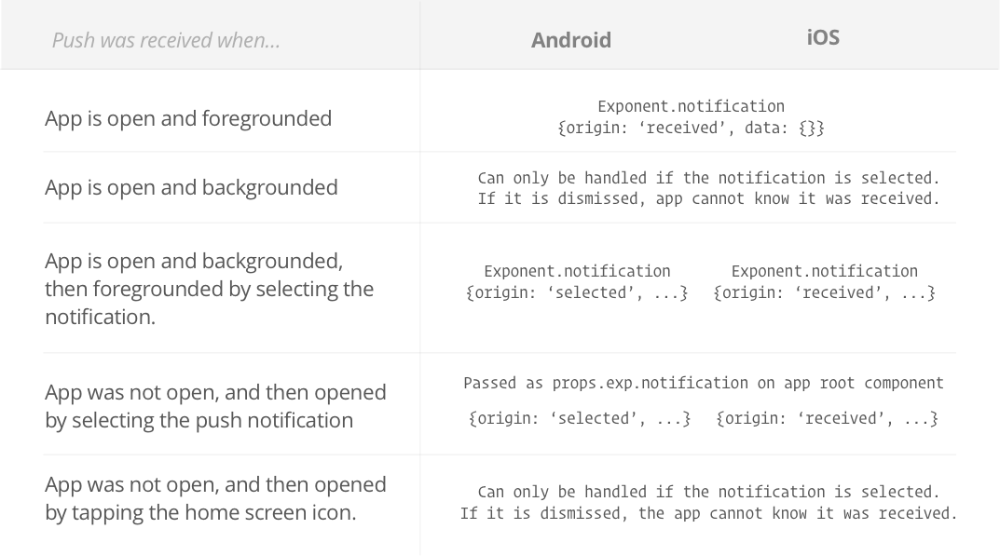

.. _push-notifications:

******************
Push Notifications
******************

Push Notifications are an important feature to, as *"growth hackers"* would
say, retain and re-engage users and monetize on their attention, or something.
From my point of view it's just super handy to know when a relevant event
happens in an app so I can jump back into it and read more. Let's look at how
to do this with Exponent. Spoiler alert: it's almost too easy.

.. epigraph::
  **Note:** iOS and Android simulators cannot receive push notifications, to test them out you will need to use a real-life device. Additionally, when calling Permissions.askAsync on the simulator, it will resolve immediately with "undetermined" as the status, regardless of whether you choose to allow or not.

There are three main steps to wiring up push notifications: sending a user's
Exponent Push Token to your server, calling Exponent's Push API with the token
when you want to send a notification, and responding to receiving and/or
selecting the notification in your app (for example to jump to a particular
screen that the notification refers to).

1. Save the user's Exponent Push Token on your server
^^^^^^^^^^^^^^^^^^^^^^^^^^^^^^^^^^^^^^^^^^^^^^^^^^^^^

.. figure:: img/saving-token.png
  :width: 100%
  :alt: Diagram explaining saving tokens

  In order to send a push notification to somebody, we need to know about their device. Sure, we know our user's account information, but Apple, Google, and Exponent do not understand what devices correspond to "Brent" in your propiertary user account system. Exponent takes care of identifying your device with Apple and Google through the Exponent push token, so all we need to do is send this to your server so you can associate it with the user account and use it in the future for sending push notifications.

.. code-block:: javascript

  import { Permissions, Notifications } from 'exponent';

  const PUSH_ENDPOINT = 'https://your-server.com/users/push-token';

  async function registerForPushNotificationsAsync() {
    // Android remote notification permissions are granted during the app
    // install, so this will only ask on iOS
    let { status } = await Permissions.askAsync(Permissions.REMOTE_NOTIFICATIONS);

    // Stop here if the user did not grant permissions
    if (status !== 'granted') {
      return;
    }

    // Get the token that uniquely identifies this device
    let token = await Notifications.getExponentPushTokenAsync();

    // POST the token to our backend so we can use it to send pushes from there
    return fetch(PUSH_ENDPOINT, {
      method: 'POST',
      headers: {
        'Accept': 'application/json',
        'Content-Type': 'application/json',
      },
      body: JSON.stringify({
        token: {
          value: token,
         },
         user: {
          username: 'Brent',
         },
      }),
    });
  }

2. Call Exponent's Push API with the user's token
^^^^^^^^^^^^^^^^^^^^^^^^^^^^^^^^^^^^^^^^^^^^^^^^^

.. figure:: img/sending-notification.png
  :width: 100%
  :alt: Diagram explaining sending a push from your server to device

  Push notifications have to come from somewhere, and that somewhere is your server, probably (you could write a command line tool to send them if you wanted, it's all the same). When you're ready to send a push notification, grab the Exponent push token off of the user record and send it over to the Exponent API using a plain old HTTP POST request. We've taken care of wrapping that for you in a few languages:

  - `exponent-server-sdk-ruby <https://github.com/exponentjs/exponent-server-sdk-ruby>`_
  - `exponent-server-sdk-python <https://github.com/exponentjs/exponent-server-sdk-python>`_
  - `exponent-server-sdk-node <https://github.com/exponentjs/exponent-server-sdk-node>`_

  Check out the source if you would like to implement it in another language. For the sake of demonstration, let's look at our `simple-rails-push-server-example <https://github.com/exponentjs/simple-rails-push-server-example>`_.

.. code-block:: ruby

  require 'exponent-server-sdk'

  class TokensController < ApplicationController
    def create
      # You probably actually want to associate this with a user,
      # otherwise it's not particularly useful
      @token = Token.where(value: params[:token][:value]).first

      message = ''
      if @token.present?
        message = 'Welcome back!'
      else
        @token = Token.create(token_params)
        message = 'Welcome to Exponent'
      end

      exponent.publish(
        exponentPushToken: @token.value,
        message: message,
        data: {a: 'b'}, # Data is required, pass any arbitrary data to include with the notification
      )

      render json: {success: true}
    end

    private

    def token_params
      params.require(:token).permit(:value)
    end

    def exponent
      @exponent ||= Exponent::Push::Client.new
    end
  end

3. Handle receiving and/or selecting the notification
^^^^^^^^^^^^^^^^^^^^^^^^^^^^^^^^^^^^^^^^^^^^^^^^^^^^^

For Android, this step is entirely optional -- if your notifications are purely
informational and you have no desire to handle them when they are received or
selected, you're already done. Notifications will appear in the system
notification tray as you've come to expect, and tapping them will open/foreground
the app.

For iOS, you would be wise to handle push notifications that are received while
the app is foregrounded, because otherwise the user will never see them.
Notifications that arrive while the app are foregrounded on iOS do not show up
in the system notification list. A common solution is to just show the notification
manually. For example, if you get a message on Messenger for iOS, have the app
foregrounded, but do not have that conversation open, you will see the
notification slide down from the top of the screen with a custom notification
UI.

Thankfully, handling push notifications is straightforward with Exponent, all
you need to do is add a listener to the ``Notifications`` object.

.. code-block:: javascript

  import React from 'react';
  import Exponent, {
    Notifications,
  } from 'exponent';
  import {
    Text,
    View,
  } from 'react-native';

  import registerForPushNotificationsAsync from 'registerForPushNotificationsAsync';

  class AppContainer extends React.Component {
    state = {
      notification: {},
    };

    componentWillMount() {
      registerForPushNotificationsAsync();

      // Handle notifications that are received or selected while the app
      // is open. If the app was closed and then opened by tapping the
      // notification (rather than just tapping the app icon to open it),
      // this function will fire on the next tick after the app starts
      // with the notification data.
      this._notificationSubscription = Notifications.addListener(this._handleNotification);
    }

    _handleNotification = (notification) => {
      this.setState({notification: notification});
    };

    render() {
      return (
        <View style={{flex: 1, justifyContent: 'center', alignItems: 'center'}}>
          <Text>Origin: {this.state.notification.origin}</Text>
          <Text>Data: {JSON.stringify(this.state.notification.data)}</Text>
        </View>
      );
    }
  }

  Exponent.registerRootComponent(AppContainer);

Notification handling timing
""""""""""""""""""""""""""""

It's not entirely clear from the above when your app will be able to handle the
notification depending on it's state at the time the notification is received.
For clarification, see the following table:

