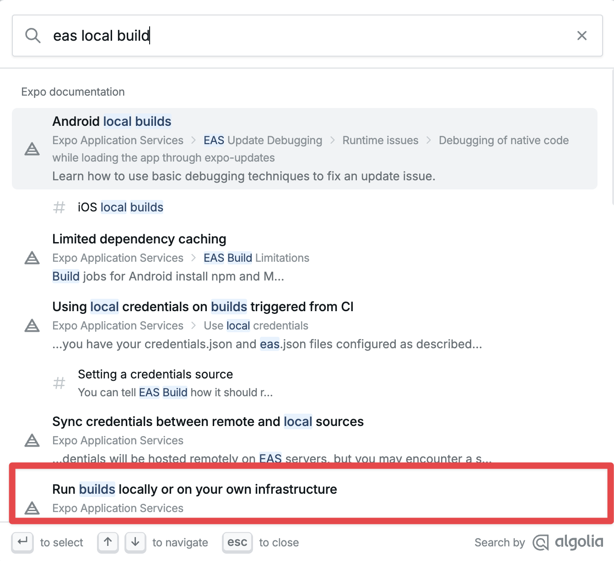
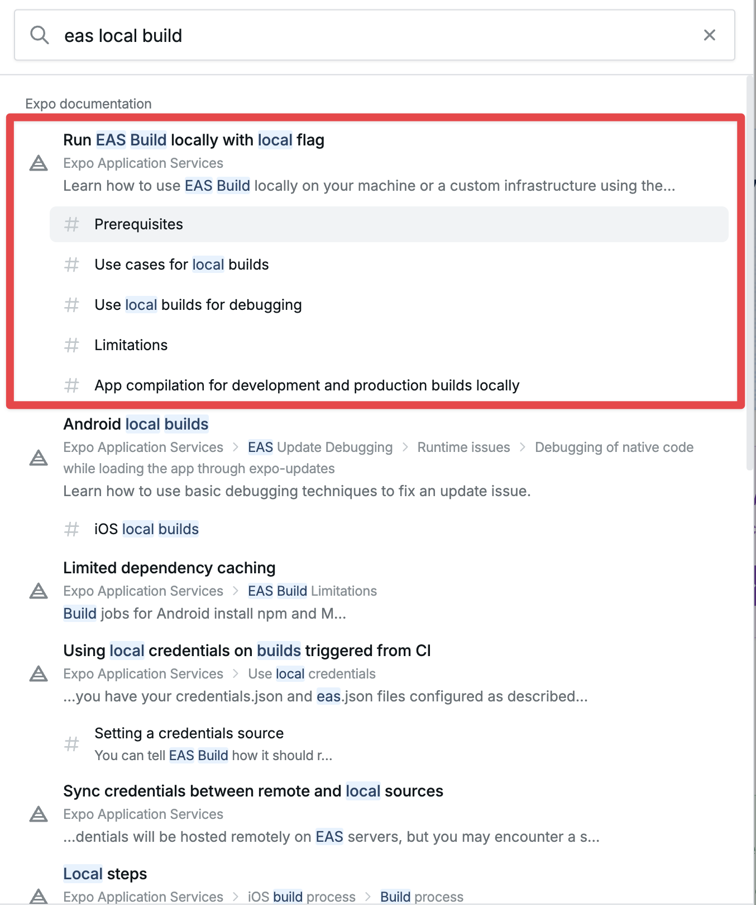
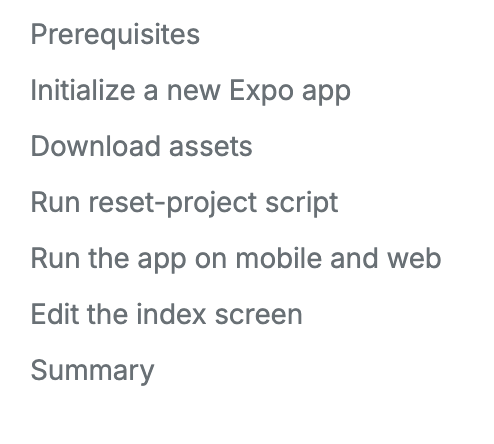
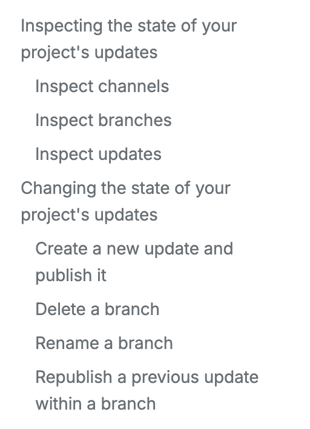

# Writing headings optimized for search

In Expo documentation, _headings_ provide structure and reference points to help developers search and scan any document. Part of our job is to help them reach the point they need to solve their problem.

Following suggestions and tips from this guide will help you to write document titles and section headings that are easy to search and make a document scannable.

---

Let's start with an example where a heading is unaligned to its document's content:

Based on the search term above, the correct page appears as the last item. The search term contains all keywords that are common with the way we talk about running an EAS Build on a local computer.

Using the context of a keyword (commonly used term), improves the search ranking of the document when the same search term is used:

The improvement above also tells the developer about the primary purpose of the document on first glance.

## General tips

When writing a document title or a section heading, do the following:

- Be concise.
- Describe the main purpose of the document or the section
- For procedural documents (guides and tutorials), use a verb-based title/heading to describe the action that you expect the developer to perform. Using an action verb also informs the developer about the type of content they can expect to find once they land on the page and start scanning it.
- Front-load keywords in headings to keep the important information or subject at the beginning.
- Focus on what matters most to customers and choose words they would use themselves.
- Use sentence case for a section or sub-section headings. For more details, see [formatting guidelines for headings](./Expo%20Documentation%20Writing%20Style%20Guide.md#headings)

### Document titles

When using multiple content types in the same document, such as a section or two to describe a procedure that is followed by a section that explains the concept, use a task-based title (action-based verbs) for that document.

### Heading types

Procedural documents:

- Used in quick starts, how-to guides, and tutorials
- Write a task-based title/heading using a verb to describe the action

> [!TIP]
> When multiple headings in the same document are wordy or not parallel, they make the document hard to scan and defeat the purpose of representing the information clearly.

An example of the action-based verb used in a tutorial is shown below:

Non-procedural documents:

You can use noun phrases in the section headings and these phrases can start with _-ing_ verb.

An example of a conceptual guide that has procedural instructions as sub-sections. It also uses a parallel structure between H2s (using _ing_) and H3s (action-based verbs):

### Heading structures

Headings are the outline of a document. Breaking text logically into smaller sections, makes the document scannable, parts of that document searchable, and provides logical structure.

When writing headings, use H2s to communicate the most important information or subject. If a section heading contains two or more distinct but related topics, use sub-headings (H3s, H4s) to break the large section.
