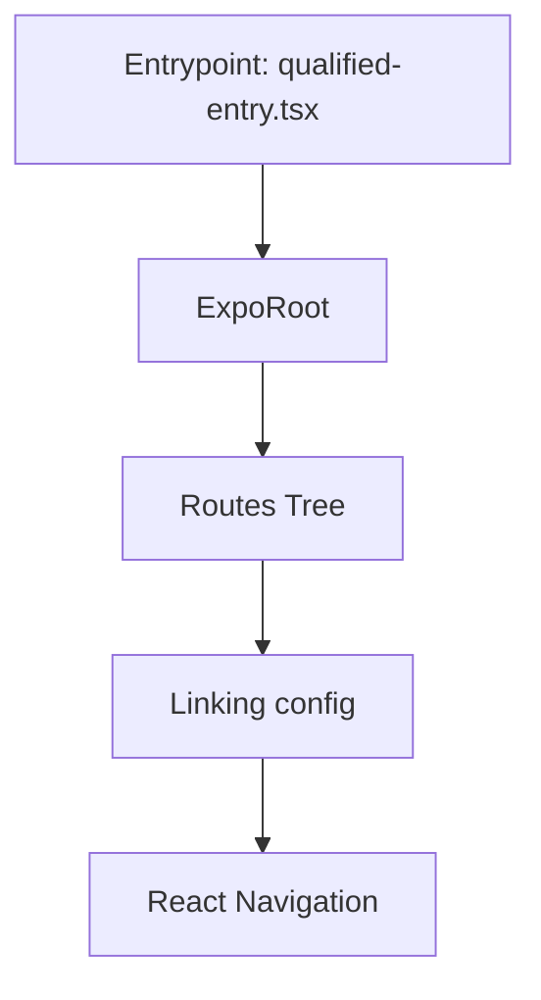
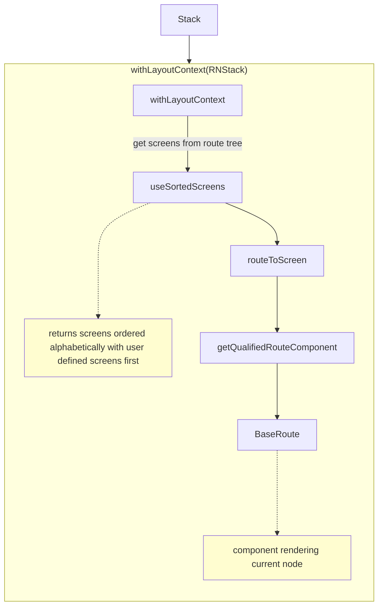
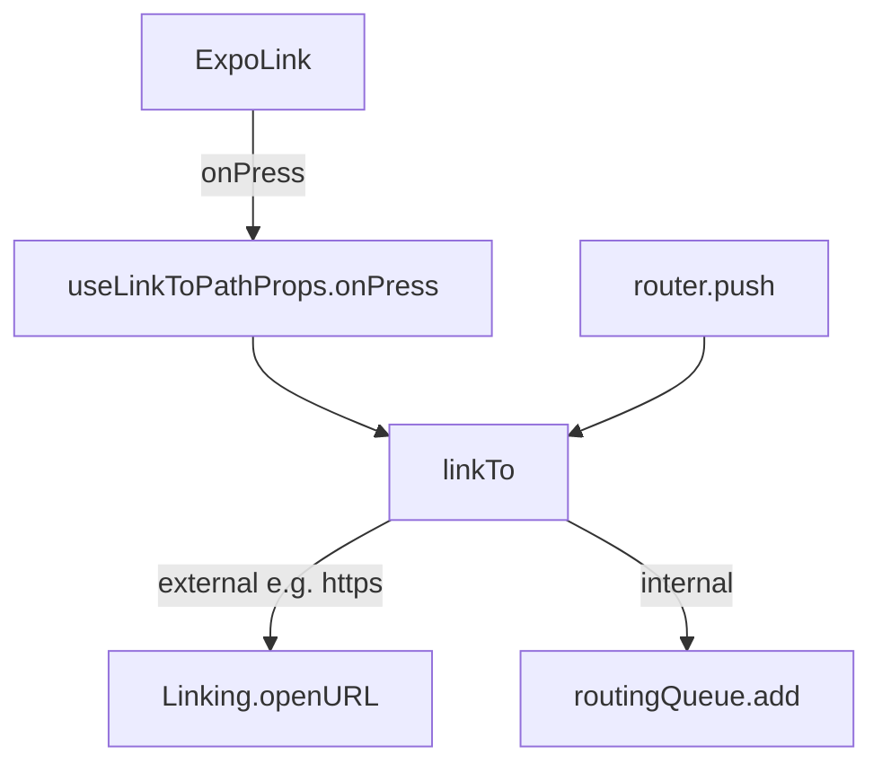
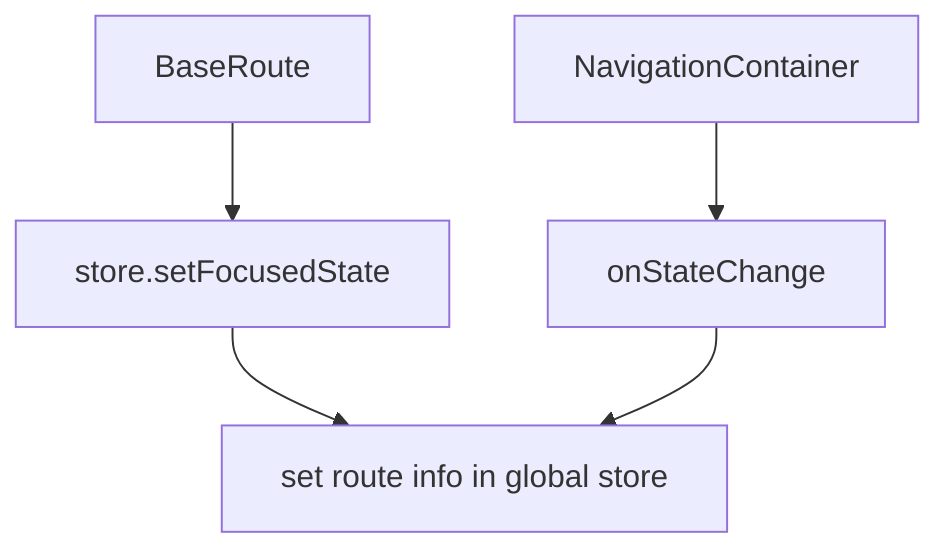

## Init process



- packages/expo-router/src/qualified-entry.tsx
- packages/expo-router/src/ExpoRoot.tsx:63
- ContextNavigator - packages/expo-router/src/ExpoRoot.tsx:103
- useStore in ContextNavigator - packages/expo-router/src/ExpoRoot.tsx:145
- useStore definition - packages/expo-router/src/global-state/router-store.tsx:146
- getRoutes definition - packages/expo-router/src/getRoutes.ts:18

- https://reactnavigation.org/docs/navigation-container

## What components to render



- withLayoutContext - packages/expo-router/src/layouts/withLayoutContext.tsx:144
- useSortedScreens - packages/expo-router/src/useScreens.tsx:161
- getQualifiedRouteComponent - packages/expo-router/src/useScreens.tsx:237
- routeToScreen - packages/expo-router/src/useScreens.tsx:464
- BaseRoute - packages/expo-router/src/useScreens.tsx:266

- https://reactnavigation.org/docs/navigator
- https://docs.expo.dev/versions/unversioned/sdk/router/#withlayoutcontextnav-processor-useonlyuserdefinedscreens
- https://docs.expo.dev/router/migrate/from-react-navigation/#rewrite-custom-navigators

## Navigation flow

Navigation methods in router:

- `router.push` (`replace`, `prefetch`, etc.) - imperative
- `<Link>` - declarative



- ExpoLink - packages/expo-router/src/link/ExpoLink.tsx
- BaseExpoRouterLink - packages/expo-router/src/link/BaseExpoRouterLink.tsx
- router.push - packages/expo-router/src/global-state/routing.ts:122
- routingQueue.add - packages/expo-router/src/global-state/routing.ts:64
- useLinkToPathProps.onPress - packages/expo-router/src/link/useLinkToPathProps.tsx:45
- linkTo - packages/expo-router/src/global-state/routing.ts:230


```mermaid
flowchart TD
    flowchart TD
    useImperativeApiEmitter -->
    routingQueueSubscribe["useSyncExternalStore(routingQueue.subscribe,"] -->
    routingQueueRun["routingQueue.run"] -->
    rnDispatch["dispatch react navigation action"] -->
    router["current router getStateForAction"] -->
    newState["new state"]
```

- useImperativeApiEmitter + run - packages/expo-router/src/imperative-api.tsx:118
- getStateForAction
  - packages/expo-router/src/layouts/StackClient.tsx:162
  - packages/expo-router/src/native-tabs/NativeBottomTabsRouter.tsx:30

- https://reactnavigation.org/docs/navigation-object#dispatch
- https://reactnavigation.org/docs/navigation-actions
- https://reactnavigation.org/docs/custom-routers
- https://reactnavigation.org/docs/custom-navigators

edge cases:

- navigation to a new navigator has a bit different flow. The new state does not include full route, but params with `screen` param. This is later resolved by `useNavigationBuilder` - local state can get out of sync with global state - https://reactnavigation.org/docs/nesting-navigators/

## State

https://reactnavigation.org/docs/navigation-state/

Example: packages/expo-router/src/layouts/StackClient.tsx:162

## Hooks and route info - global state

packages/expo-router/src/hooks.ts - packages/expo-router/src/imperative-api.tsx:115

### useRouter

This hook returns reference to a global router object - packages/expo-router/src/imperative-api.tsx:102

The global object is created from gathering individual methods - packages/expo-router/src/global-state/routing.ts:122

### useRouteInfo = usePathname/useSegments/useSearchParams

This are the hooks which return information about the current route.



useRouteInfo uses `useSyncExternalStore` to subscribe to changes in the route info - packages/expo-router/src/global-state/router-store.tsx:261

- setFocusedState - packages/expo-router/src/global-state/router-store.tsx:90
- onStateChange - packages/expo-router/src/ExpoRoot.tsx:172
