# expo-splash-screen

`expo-splash-screen` allows you to customize your app's splash screen, which is the initial screen users see when the app is launched, before it has loaded. Splash screens (sometimes called launch screens) provide a user's first experience with your application.

- [📜	CHANGELOG](./CHANGELOG.md)
- [🚀 Features](#-features)
- [📚 API](#-api)
- [🗒 Examples](#-examples)
- [💻 Installation in managed Expo projects](#-installation-in-managed-expo-projects)
- [🖥 Installation in bare React Native projects](#-installation-in-bare-react-native-projects)
  - [📱 Configure iOS](#-configure-ios)
  - [🤖 Configure Android](#-configure-android)
- [👏 Contributing](#-contributing)
- [❓ Known issues](#-known-issues)
- [🏅 Hall of fame](#-hall-of-fame)

## 🚀 Features

### Built-in splash screen image resize modes

`expo-splash-screen` contains a built-in feature for taking care of properly displaying your splash screen image. You can use the following resize modes to obtain behavior as if you were using the React Native `<Image>` component's `resizeMode` style.

#### `CONTAIN` resize mode

Scale the image uniformly (maintaining the image's aspect ratio) so that both dimensions the width and height of the image will be equal to or less than the corresponding dimension of the device's screen.

| Android                                                   | iOS                                                        |
|-----------------------------------------------------------|------------------------------------------------------------|
|  | 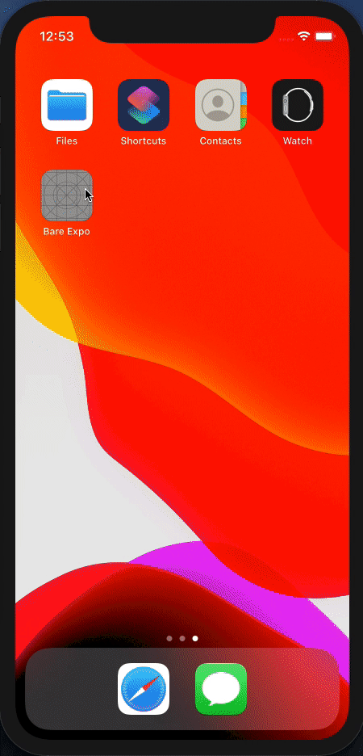  |

#### `COVER` resize mode

Scale the image uniformly (maintaining the image's aspect ratio) so that both the width and height of the image will be equal to or larger than the corresponding dimension of the device's screen.

| Android                                                   | iOS                                                        |
|-----------------------------------------------------------|------------------------------------------------------------|
|  | 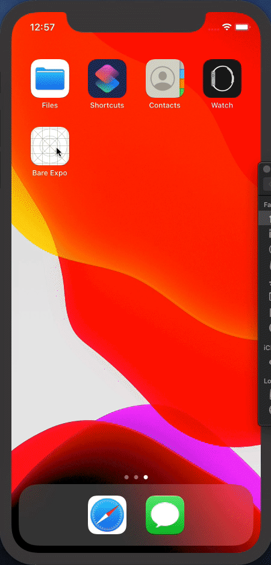  |

#### `NATIVE` resize mode

> **Android only.**

By using this resize mode your app will will leverage Android's ability to present a static bitmap while the application is starting up.
Android (unlike iOS) does not support stretching of the provided image during launch, so the application will present the given image centered on the screen at its original dimensions.

| Android                                                   |
|-----------------------------------------------------------|
|  |

> Animation above presents one of our [known issues](#native-mode-pushes-splash-image-up-a-little-bit)

Selecting this resize mode requires some more work to be done in native configuration.
Please take a look at the [`res/drawable/splashscreen.xml`](#resdrawablesplashscreenxml) and [`res/drawable/splashscreen_background.png`](#resdrawablesplashscreen_backgroundpng) sections.

### Per-appearance (a.k.a. dark-mode) splash screen

`expo-splash-screen` supports per-appearance splash screens that respond to system appearance changes on iOS 13+ and dark-mode changes on Android 10+.

### StatusBar customization

`expo-splash-screen` allows customization of the StatusBar according to the [ReactNative StatusBar API](https://reactnative.dev/docs/statusbar).

## 📚 API

```tsx
import * as SplashScreen from 'expo-splash-screen';
```

The native splash screen that is controlled via this module autohides once the ReactNative-controlled view hierarchy is mounted. This means that when your app first `render`s view component, the native splash screen will hide. This default behavior can be prevented by calling [`SplashScreen.preventAutoHideAsync()`](#splashscreenpreventautohideasync) and later on [`SplashScreen.hideAsync()`](#splashscreenhideasync).

### `SplashScreen.preventAutoHideAsync()`

This method makes the native splash screen stay visible until [`SplashScreen.hideAsync()`](#splashscreenhideasync) is called. This must be called before any ReactNative-controlled view hierarchy is rendered (either in the global scope of your main component, or when the component renders `null` at the beginning - see [Examples section](#-examples)).

Preventing default autohiding might come in handy if your application needs to prepare/download some resources and/or make some API calls before first rendering some actual view hierarchy.

#### Returns

A `Promise` that resolves to `true` when preventing autohiding succeeded and to `false` if the native splash screen is already prevented from autohiding (for instance, if you've already called this method).
`Promise` rejection most likely means that native splash screen cannot be prevented from autohiding (it's already hidden when this method was executed).

### `SplashScreen.hideAsync()`

Hides the native splash screen. Only works if the native splash screen has been previously prevented from autohiding by calling [`SplashScreen.preventAutoHideAsync()`](#splashscreenpreventautohideasync) method.

#### Returns

A `Promise` that resolves to `true` once the splash screen becomes hidden and to `false` if the splash screen is already hidden.

## 🗒 Examples

### `SplashScreen.preventAutoHideAsync()` in global scope

`App.tsx`
```tsx
import React from 'react';
import { StyleSheet, Text, View } from 'react-native';
import * as SplashScreen from 'expo-splash-screen';

// Prevent native splash screen from autohiding before App component declaration
SplashScreen.preventAutoHideAsync()
  .then(result => console.log(`SplashScreen.preventAutoHideAsync() succeeded: ${result}`))
  .catch(console.warn); // it's good to explicitly catch and inspect any error

export default class App extends React.Component {
  componentDidMount() {
    // Hides native splash screen after 2s
    setTimeout(async () => {
      await SplashScreen.hideAsync();
    }, 2000);
  }

  render() {
    return (
      <View style={styles.container}>
        <Text style={styles.text}>SplashScreen Demo! 👋</Text>
      </View>
    )
  }
}

const styles = StyleSheet.create({
  container: {
    flex: 1,
    alignItems: 'center',
    justifyContent: 'center',
    backgroundColor: '#aabbcc',
  },
  text: {
    color: 'white',
    fontWeight: 'bold',
  },
});
```

### `SplashScreen.preventAutoHideAsync()` in component that initially renders `null`

`App.tsx`
```tsx
import React from 'react';
import { StyleSheet, Text, View } from 'react-native';
import * as SplashScreen from 'expo-splash-screen';

export default class App extends React.Component {
  state = {
    appIsReady: false,
  };

  async componentDidMount() {
    // Prevent native splash screen from autohiding
    try {
      await SplashScreen.preventAutoHideAsync();
    } catch (e) {
      console.warn(e);
    }
    this.prepareResources();
  }

  /**
   * Method that serves to load resources and make API calls
   */
  prepareResources = async () => {
    await performAPICalls(...);
    await downloadAssets(...);

    this.setState({ appIsReady: true }, async () => {
      await SplashScreen.hideAsync();
    });
  }

  render() {
    if (!this.state.appIsReady) {
      return null;
    }

    return (
      <View style={styles.container}>
        <Text style={styles.text}>SplashScreen Demo! 👋</Text>
      </View>
    )
  }
}

const styles = StyleSheet.create({
  container: {
    flex: 1,
    alignItems: 'center',
    justifyContent: 'center',
    backgroundColor: '#aabbcc',
  },
  text: {
    color: 'white',
    fontWeight: 'bold',
  },
});
```


## 💻 Installation in managed Expo projects

Refer to [the SplashScreen section of the Expo documentation](https://docs.expo.io/versions/latest/sdk/splash-screen/).

## 🖥 Installation in bare React Native projects

For bare React Native projects, you must ensure that you have [installed and configured the `react-native-unimodules` package](https://github.com/expo/expo/tree/master/packages/react-native-unimodules) before continuing.

## Add the package to your dependencies

```
expo install expo-splash-screen
```

## 📱 Configure iOS

Run `npx pod-install` after installing the package.

### Automatic configuration

The easiest way to configure the splash screen in bare React Native projects is with the expo-splash-screen command. See the [README](https://github.com/expo/expo-cli/tree/master/unlinked-packages/configure-splash-screen) for more information, or run `yarn expo-splash-screen --help` in your project.

### Manual Configuration

To achieve native splash screen (in iOS ecosystem it's called `LaunchScreen`) behavior, you have to provide either a `SplashScreen.storyboard` file or a `SplashScreen.xib` file, and configure your Xcode project accordingly.

The guide below shows how to configure your Xcode project to use a single image file as a splash screen using a `.storyboard` file (configuration for `.xib` filetype is analogous).

1. [Add an image to `Images.xcassets`](#-add-an-image-to-imagesxcassets)
2. [Create `SplashScreen.storyboard`](#-create-splashscreenstoryboard)
3. [Select `Content Mode` for the `ImageView` in `SplashScreen.storyboard`](#-select-content-mode-for-the-imageview-in-splashscreenstoryboard)
4. [Mark `SplashScreen.storyboard` as the LaunchScreen](#-mark-splashscreenstoryboard-as-the-launchscreen)
5. [(<em>optional</em>) Enable dark mode](#-optional-enable-dark-mode)
6. [(<em>optional</em>) Customize StatusBar](#-customize-statusbar)

#### 🛠 Add an image to `Images.xcassets`

First you need to add the image file that would serve as a splash screen to your native project's resources.

1. In your Xcode project open the `.xcassets` (often named `Images.xcassets` or `Assets.xcassets`) file.
2. In the content panel add `New image set` and name it `SplashScreen`.
3. Provide the splash screen image you've prepared (you have to provide it in three different scales).

<details>
 <summary>Show image with details</summary>
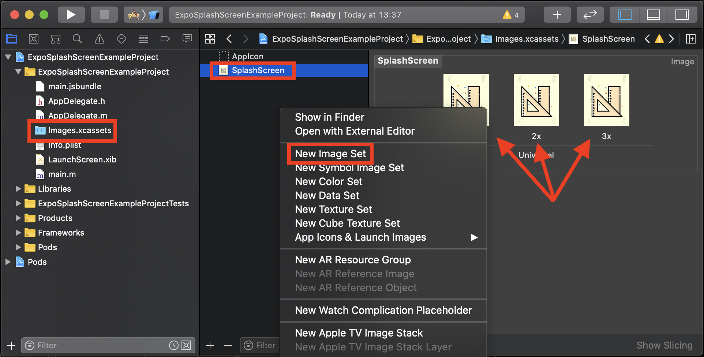
</details>

#### 🛠 Create `SplashScreen.storyboard`

This is the actual splash screen definition and will be used by the system to render your splash screen.

1. Create a `SplashScreen.storyboard` file.
2. Add a `View Controller` to the newly created `.storyboard` file:
    - open `Library` (`+` button on the top-right),
    - find `View Controller` element,
    - drag-and-drop it to the `.storyboard` file.

<details>
 <summary>Show image with details</summary>
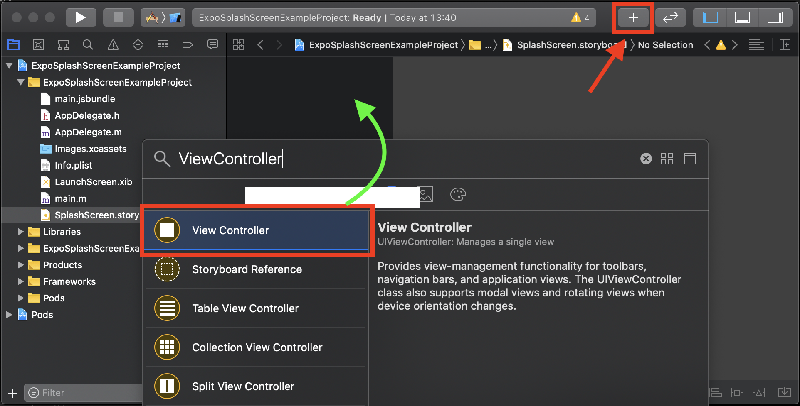
</details>

3. Add an `Image View` to the `View Controller`:
    - first remove other `View` element from `View Controller`,
    - open `Library` (`+` button on the top-right),
    - find `Image View` element,
    - drag-and-drop it as a `View Controller` child in view hierarchy inspector.

<details>
 <summary>Show image with details</summary>
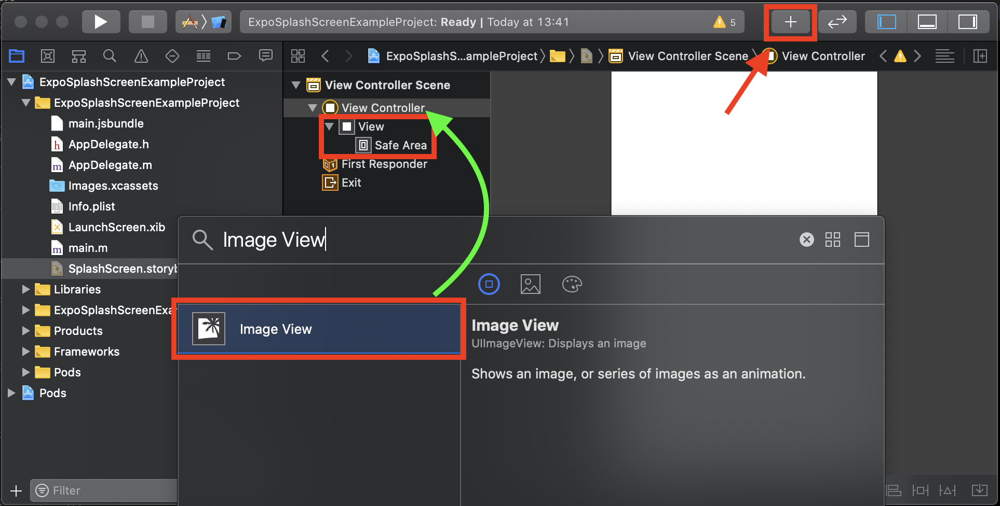
</details>

4. Set `Storyboard ID` to `SplashScreenViewController`:
    - select `View Controller` in view hierarchy inspector,
    - navigate to `Identity Inspector` in the right panel,
    - and set `Storyboard ID` to `SplashScreenViewController`.

<details>
 <summary>Show image with details</summary>
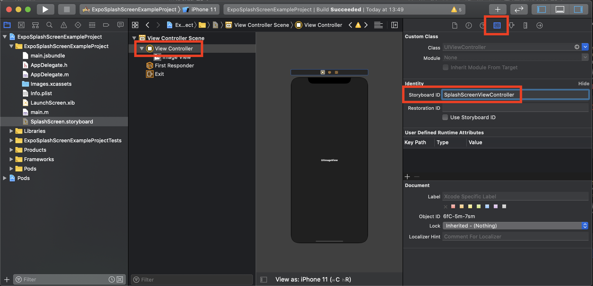
</details>

5. Tick `Is Initial View Controller` in `SplashScreenViewController`:
    - select `View Controller` in view hierarchy inspector,
    - navigate to `Attributes Inspector` in the right panel,
    - and tick `Is Initial View Controller` in View Controller section.

<details>
 <summary>Show image with details</summary>
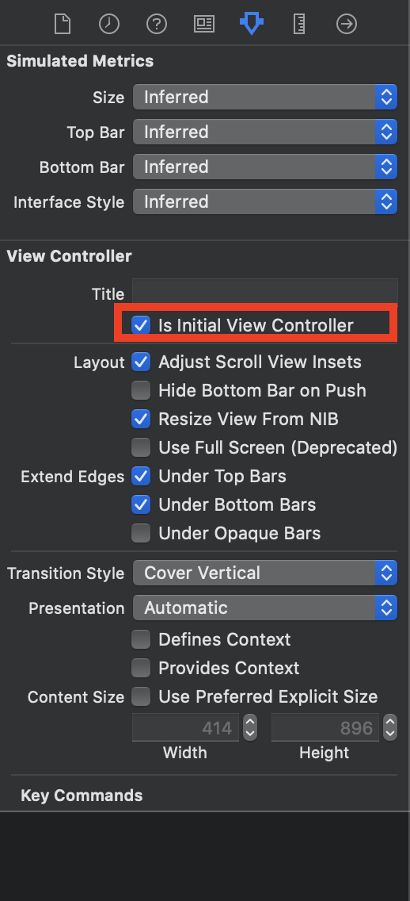
</details>

6. Configure `Image View` source:
    - select `Image View` in view hierarchy inspector,
    - navigate to `Attributes Inspector` in the right panel,
    - select `SplashScreen` in `Image` parameter).

<details>
 <summary>Show image with details</summary>
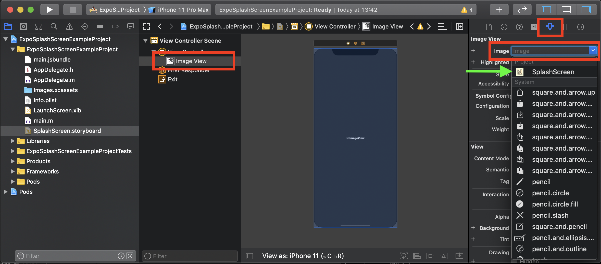
</details>

7. Configure `Background` of the `Image View`:
    - select `Image View` in view hierarchy inspector,
    - navigate to `Attributes Inspector` in the right panel,
    - configure `Background` parameter:
        - To enter a `#RRGGBB` value you need to select `Custom` option and in the `Colors Popup` that appeared you need to navigate to the second tab and choose `RGB Sliders` from dropdown select.

<details>
 <summary>Show image with details</summary>
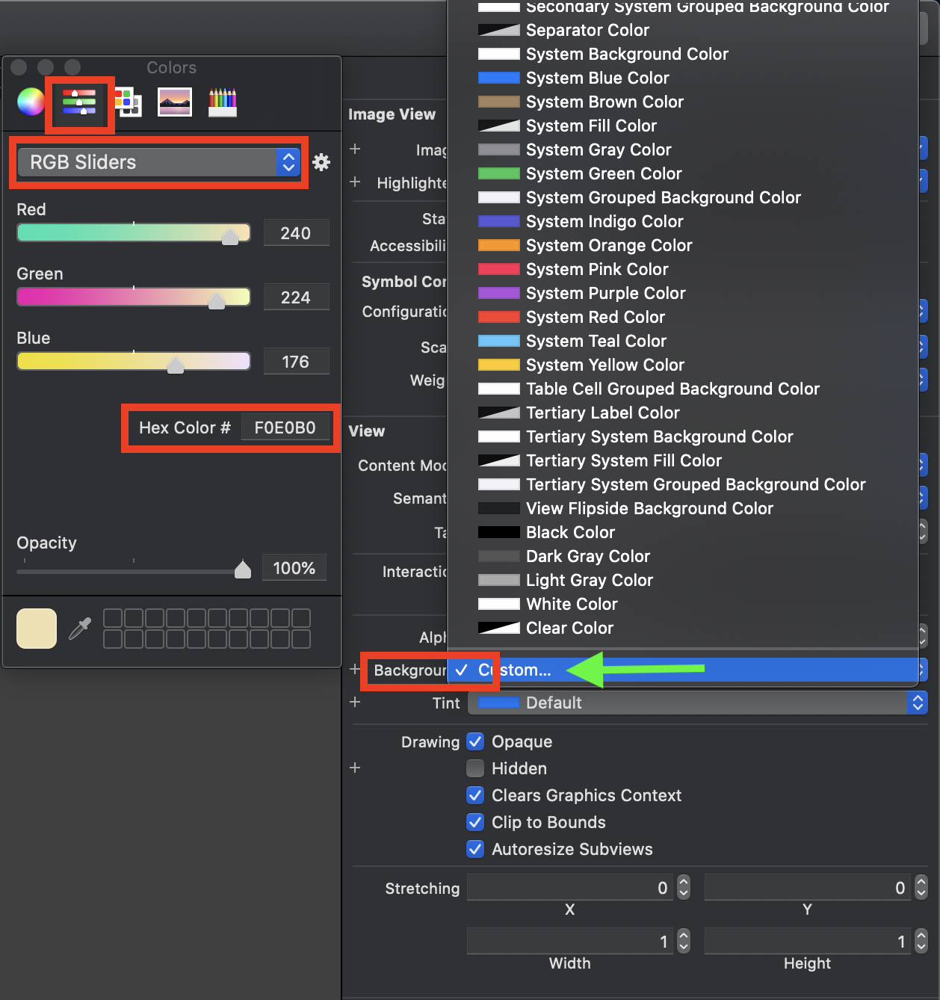
</details>

#### 🛠 Select `Content Mode` for the `ImageView` in `SplashScreen.storyboard`

This is how your image will be displayed on the screen.

1. Open `SplashScreen.storyboard` and select `Image View` from `View Controller`.
2. Navigate to `Attributes Inspector` in the right panel and locate `Content Mode`.
3. Select one of the following:
    - `Aspect Fit` to obtain [CONTAIN resize mode](#contain-resize-mode),
    - `Aspect Fill` to obtain [COVER resize mode](#cover-resize-mode).
4. You can always choose other options to achieve different image positioning and scaling.

<details>
 <summary>Show image with details</summary>
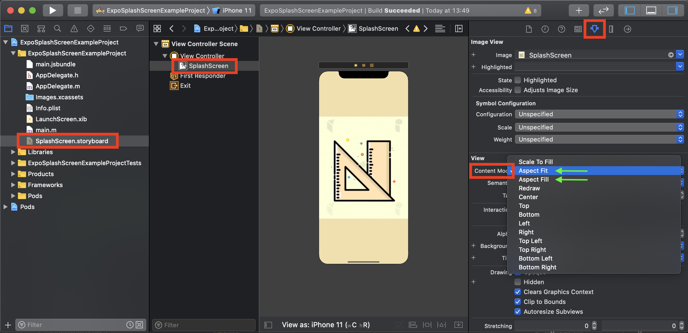
</details>

#### 🛠 Mark `SplashScreen.storyboard` as the LaunchScreen

The newly created `SplashScreen.storyboard` needs to be marked as the `Launch Screen File` in your Xcode project in order to be presented from the very beginning of your application launch.

1. Select your project in `Project Navigator`
2. Select your project name from `TARGETS` panel and navigate to `General` tab.
3. Locate `App Icons and Launch Images` section and `Launch Screen File` option.
4. Select or enter `SplashScreen` as the value for located option.

<details>
 <summary>Show image with details</summary>
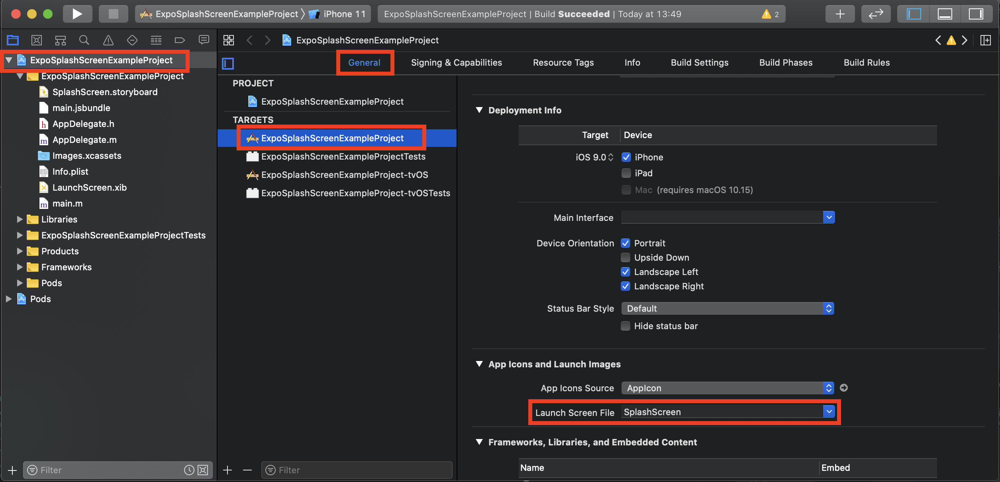
</details>

#### 🛠 (<em>optional</em>) Enable dark mode

##### Provide different background colors

Depending on what iOS version your application is targeting, you have to adjust your native project differently to a obtain working per-appearance splash screen view.

##### I'm targeting iOS 11+

You can take advantage of [`named colors`](https://developer.apple.com/library/archive/documentation/DeveloperTools/Conceptual/WhatsNewXcode/xcode_9/xcode_9.html) in your Xcode project.

1. Create a new `Color Set` and customize its values for different color modes:
    - in your `.xcassets` directory (either create a new `.xcassets` for colors, or reuse an existing one e.g. with images) create `New Color Set` and name it `SplashScreenBackground`,
    - navigate to `Attributes Inspector` in the right panel and change `Appearance` to `Any, Dark`,
    - select desired color in `Attributes Inspector` in the right panel for each mode.

<details>
 <summary>Show image with details</summary>
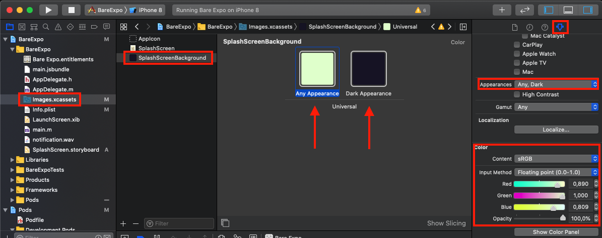
</details>

2. Select created `named color` as the `Background` for the `Image View` in `SplashScreen.storyboard`:
    - open `SplashScreen.storyboard` and select `Image View` in view hierarchy inspector,
    - navigate to `Attributes Inspector` in the right panel,
    - configure `Background` parameter by selecting your created `named color` (that should be listed as `SplashScreenBackground`).

<details>
 <summary>Show image with details</summary>
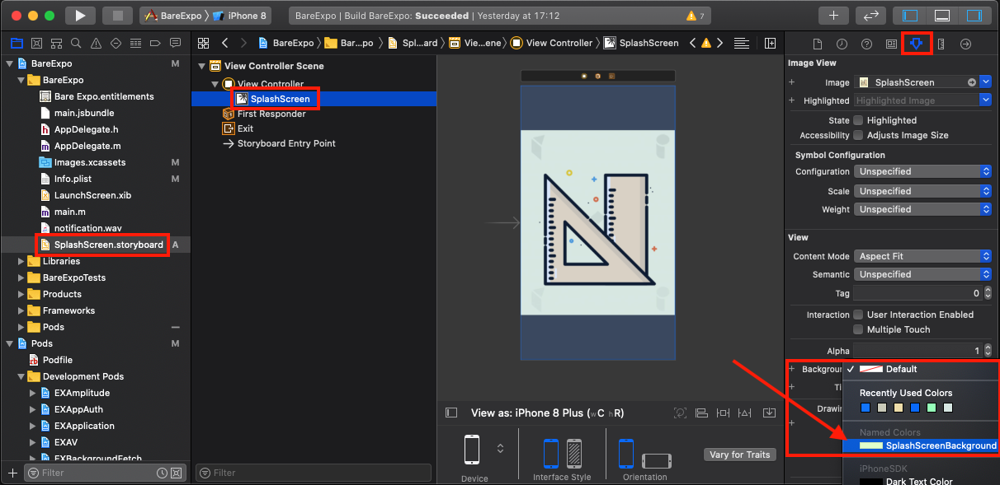
</details>

##### I'm targeting iOS version < 11

You cannot use [`named colors`](https://developer.apple.com/library/archive/documentation/DeveloperTools/Conceptual/WhatsNewXcode/xcode_9/xcode_9.html) feature in your Xcode project.
Instead you have to create an additional image set that contains small 1x1px images, each with the desired background color. Then, you'll use this additional image resource as a background in the splash screen view.

You can use this online generator to obtain 1x1px `.png` images with desired colors: http://www.1x1px.me.

1. Create `SplashScreenBackground` `Image Set` with desired background colors for each mode in your `Images.xcassets` directory:
    - open your `.xcassets` directory with images,
    - in the content panel add `New image set` and name it `SplashScreenBackground`,
    - convert this `Image set` to support `Dark Appearance` by navigating to `Attributes Inspector` in the right panel and changing `Appearance` to `Any, Dark`,
    - provide images with colors for every mode (you can generate color 1x1px images using http://www.1x1px.me).

<details>
 <summary>Show image with details</summary>
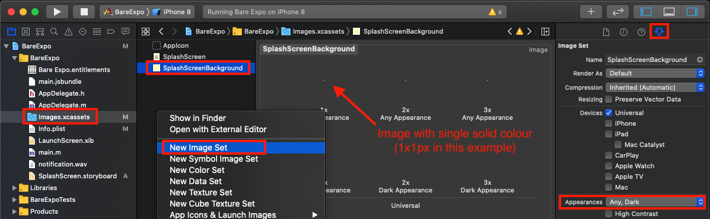
</details>

2. Update `SplashScreen.storyboard` to consist of a single top-level `View` with two `Image View` subviews (solid-colored image in the background and actual splash screen image in the foreground):
    - open `SplashScreen.storyboard` and replace `Image View` with a plain `View` (search `Library` for it and drag&drop it in place of current `Image View`),
    - add two 

3. Configure first `Image View` (background color):
    - configure attributes in `Attributes Inspector`:
        - set `Image` to `SplashScreenBackground` (prepared in previous step),
        - set `Content Mode` to `Scale To Fill` (color needs to take all available space),
    - make this subview take all available space in parent view:
        - open `Add new constraints` bottom menu,
        - make sure `Constrain to margin` is not checked,
        - for every input, open the dropdown and select `View` (parent view reference) and set `0` as the value,
        - once every side is covered (`0` value and parent view reference selected in dropdown) hit `Add 4 Constraints`,
        - observe that in `View Hierarchy Inspector` constraints are added and `Image View` resized to take whole place of parent view.

<details>
 <summary>Show image with details</summary>
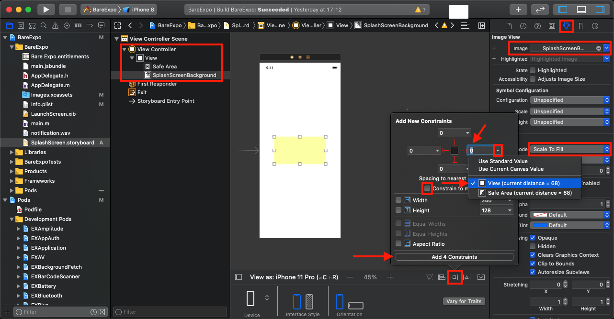
</details>

4. Configure second `Image View` (actual splash screen image):
    - select second `Image View` and select correct `Image` in `Attributes Inspector` alongside with desired `Content Mode`,
    - make this subview take all available space in parent view (see previous step).
     
<details>
 <summary>Show image with details</summary>
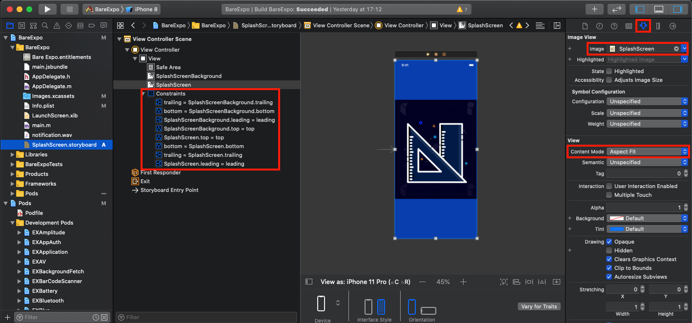
</details>

##### Provide different splash screen image

You might want to add a separate image for `dark` mode. If the system is switched to `dark` mode, it would pick this different image instead of the normal one and present it in the splash screen view.

1. In your Xcode project open `SplashScreen` (created in previous section).
2. Convert this asset to support `Dark Appearance`:
  - navigate to `Attributes Inspector` in the right panel,
  - locate `Appearances` section and select `Any, Dark`,
  - provide image for `dark mode` by dropping it to the correct box.

<details>
 <summary>Show image with details</summary>
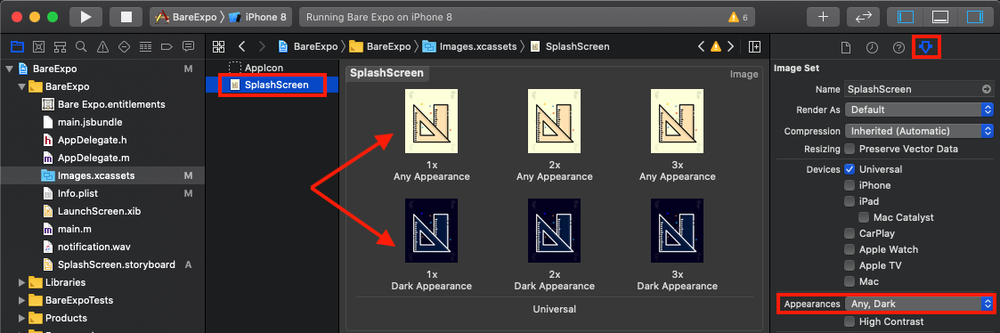
</details>

###### Background color when you want to support iOS < 11

If you're targeting a version of iOS < 11 then you cannot use `named color` feature and instead you need to generate images with desired background colors that are going to be used as the background for splash screen view.
There is this awesome 1x1px png online generator: http://www.1x1px.me (use it to generate two 1x1px images with desired background colors for different color modes).

#### 🛠 (<em>optional</em>) Customize StatusBar

You might want to customize the StatusBar appearance during the time the SplashScreen is being shown.

1. Customize `StatusBar hiding` flag:
- open main project view, select your project name from `TARGETS` panel and navigate to `Info` tab,
- add or modify `Status bar initially hidden` attribute with desired value.

<details>
 <summary>Show image with details</summary>
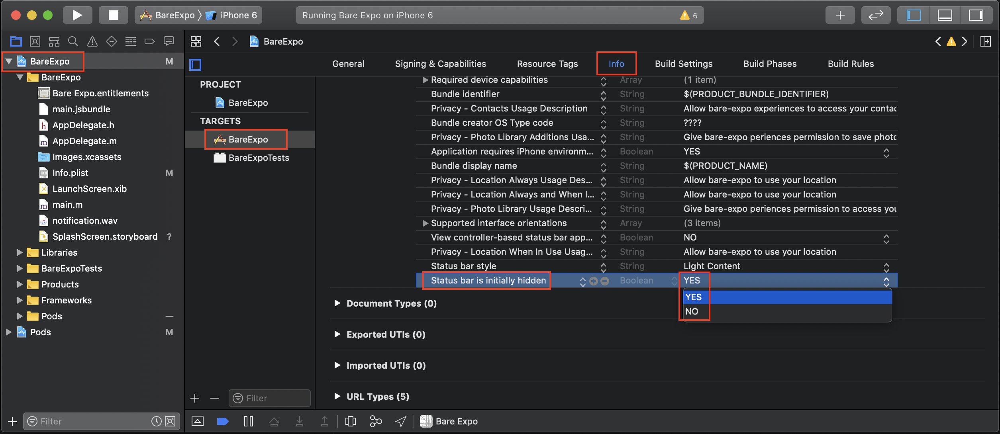
</details>

2. Customize `StatusBar style` option:
- open main project view, select your project name from `TARGETS` panel and navigate to `Info` tab,
- add or modify `Status bar style` attribute with desired value. 

<details>
 <summary>Show image with details</summary>
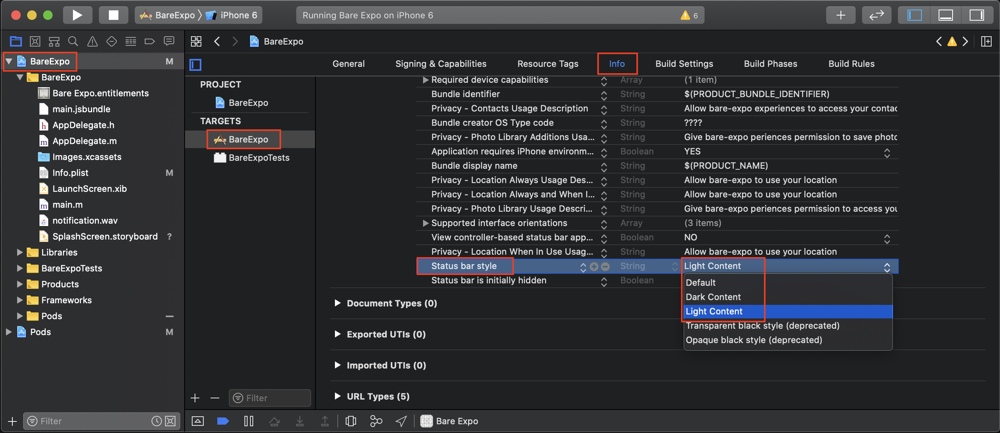
</details>

## 🤖 Configure Android

To achieve fully-native splash screen behavior, `expo-splash-screen` needs to be hooked into the native view hierarchy and consume some resources that have to be placed under `/android/app/src/res` directory.

### Automatic configuration

The easiest way to configure the splash screen in bare React Native projects is with the expo-splash-screen command. See the [README](https://github.com/expo/expo-cli/tree/master/unlinked-packages/configure-splash-screen) for more information, or run `yarn expo-splash-screen --help` in your project.

### Manual Configuration

1. [`SplashScreen.show()` method](#-splashscreenshowactivity-activity-splashscreenimageresizemode-mode-class-rootviewclass)
2. [Update `MainActivity`](#-update-mainactivityjavakt)
3. [Configure `res/drawable/splashscreen_image.png`](#-configure-resdrawablesplashscreen_imagepng)
4. [Configure `res/values/colors.xml`](#-configure-resvaluescolorsxml)
5. [Configure `res/drawable/spalashscreen.xml`](#-configure-resdrawablesplashscreenxml)
6. [Configure `res/values/styles.xml`](#-configure-resvaluesstylesxml)
7. [Configure `AndroidManifest.xml`](#-configure-androidmanifestxml)
8. [(<em>optional</em>) Enable dark mode](#-optional-enable-dark-mode-1)
9. [(<em>optional</em>) Customize StatusBar](#-customize-statusbar-1)

#### 🛠 `SplashScreen.show(Activity activity, SplashScreenImageResizeMode resizeMode, Class<out ViewGroup> rootViewClass, Boolean statusBarTranslucent)`

This native method is used to hook `SplashScreen` into the native view hierarchy that is attached to the provided activity.

You can use this method to customize how the splash screen view will be presented. Pass one of `SplashScreenImageResizeMode.{CONTAIN, COVER, NATIVE}` as second argument to do so.

#### 🛠 Update `MainActivity.{java,kt}`

Modify `MainActivity.{java,kt}` or any other activity that is marked in the application main `AndroidManifest.xml` as a main activity of your application (main activity is marked with the [`android.intent.action.MAIN`](https://developer.android.com/reference/android/content/Intent#ACTION_MAIN) intent filter. You can take a look at [this example from official Android docs](https://developer.android.com/guide/topics/manifest/manifest-intro#example)).

Ensure `SplashScreen.show(...)` method is called after `super.onCreate(...)`

```diff
+ import expo.modules.splashscreen.singletons.SplashScreen;
+ import expo.modules.splashscreen.SplashScreenImageResizeMode;

public class MainActivity extends ReactActivity {

  // other methods

  @Override
  protected void onCreate(Bundle savedInstanceState) {
    super.onCreate(savedInstanceState);
+   // SplashScreen.show(...) has to be called after super.onCreate(...)
+   SplashScreen.show(this, SplashScreenImageResizeMode.CONTAIN, ReactRootView.class, false);
    ...
  }

  // other methods
}
```

If the `onCreate` method is not yet overridden in your `MainActivity`, override it and include `SplashScreen.show(...)`

```diff
+ import android.os.Bundle;
+ import expo.modules.splashscreen.singletons.SplashScreen;
+ import expo.modules.splashscreen.SplashScreenImageResizeMode;

public class MainActivity extends ReactActivity {

+  @Override
+  protected void onCreate(Bundle savedInstanceState) {
+    super.onCreate(savedInstanceState);
+   // SplashScreen.show(...) has to be called after super.onCreate(...)
+   SplashScreen.show(this, SplashScreenImageResizeMode.CONTAIN, ReactRootView.class, false);
    ...
  }

  // other methods
}
```

#### 🛠 Configure `res/drawable/splashscreen_image.png`

You have to provide your splash screen image and place it under the `res/drawable` directory.
This image will be loaded as soon as Android mounts your application's native view hierarchy.

##### `NATIVE` mode adjustments

If you've selected `SplashScreenImageResizeMode.NATIVE` mode in [`SplashScreen.show`](#splashscreenshowactivity-activity-splashscreenimageresizemode-mode-class-rootviewclass), you need to do a few additional steps.

In your application's `res` directory you might want to have a number of `drawable-X` sub-directories (where `X` is the different DPI for different devices). They store different versions of images that are picked based on the device's DPI (for more information please see [this official Android docs](https://developer.android.com/training/multiscreen/screendensities#TaskProvideAltBmp)).

To achieve proper scaling of your splash screen image on every device you should have following directories:
- `res/drawable-mdpi` - scale 1x - resources for medium-density (mdpi) screens (~160dpi). (This is the baseline density.)
- `res/drawable-hdpi` - scale 1.5x - resources for high-density (hdpi) screens (~240dpi).
- `res/drawable-xhdpi` - scale 2x - resources for extra-high-density (xhdpi) screens (~320dpi).
- `res/drawable-xxhdpi` - scale 3x - resources for extra-extra-high-density (xxhdpi) screens (~480dpi).
- `res/drawable-xxxhdpi` - scale 4x - resources for extra-extra-extra-high-density (xxxhdpi) uses (~640dpi).

Each of directories mentioned above should contain the same `splashscreen_image.png` file, but with a different resolution (pay attention to scale factors).

#### 🛠 Configure `res/values/colors.xml`

This file contains colors that are reused across your application at the native level.
Update the file with the following content or create one if missing:

```diff
<resources>
+ <color name="splashscreen_background">#AABBCC</color> <!-- #AARRGGBB or #RRGGBB format -->
  <!-- Other colors defined for your application -->
</resources>
```

#### 🛠 Configure `res/drawable/splashscreen.xml`

This file contains the description of how the splash screen view should be drawn by the Android system.
Create the file with the following content:

```diff
+ <layer-list xmlns:android="http://schemas.android.com/apk/res/android">
+   <item android:drawable="@color/splashscreen_background"/>
+ </layer-list>
```

#### `NATIVE` mode adjustments

If you've selected `SplashScreenImageResizeMode.NATIVE` mode in [`SplashScreen.show`](#splashscreenshowactivity-activity-splashscreenimageresizemode-mode-class-rootviewclass), you should add:

```diff
<layer-list xmlns:android="http://schemas.android.com/apk/res/android">
  <item android:drawable="@color/splashscreen_background"/>
+ <item>
+   <bitmap android:gravity="center" android:src="@drawable/splashscreen_image"/>
+ </item>
</layer-list>
```

#### 🛠 Configure `res/values/styles.xml`

Locate your main activity theme in `/android/app/src/res/values/styles.xml` or create one if missing.

```diff
  <!-- Main activity theme. -->
  <style name="AppTheme" parent="Theme.AppCompat.Light.NoActionBar">
+   <item name="android:windowBackground">@drawable/splashscreen</item> <!-- this line instructs the system to use 'splashscreen.xml' as a background of the whole application -->
    <!-- Other style properties -->
  </style>
```

#### 🛠 Configure `AndroidManifest.xml`

Adjust your application's main `AndroidManifest.xml` to contain an `android:theme` property pointing to the style that contains your splash screen configuration:

```diff
<manifest xmlns:android="http://schemas.android.com/apk/res/android"
    package="com.example.myapp">

  ...

  <application ...>

+   <!-- Ensure that 'android:theme' property is pointing to the style containing native splash screen reference - see 'styles.xml' -->
    <activity
      android:name=".MainActivity"
+     android:theme="@style/AppTheme"
      ...
    >
      ...
    </activity>
  </application>

</manifest>
```

#### 🛠 (<em>optional</em>) Enable dark mode

##### Provide different background colors - `res/values-night/colors.png`

If you want to have different background colors in your splash screen depending on the system color mode, you need to create a similar file to `colors.xml`, but in the directory `res/values-night`.
Values in this file are going to picked by the system when it is switched to `dark` mode.

```diff
<resources>
+ <color name="splashscreen_background">#AABBCC</color> <!-- #AARRGGBB or #RRGGBB format -->
</resources>
```

##### Provide different splash screen image - `res/drawable-night/splashscreen_image.png`

You might want to provide a separate splash screen image for dark mode usage, and place it under the `res/drawable-night` directory with exactly the same name as the normal one.
This step is optional, because you might want to have the same image in both `light` and `dark` modes (e.g. you have just a light-themed logo and you want to have different background colors in different modes).

#### 🛠 (<em>optional</em>) Customize StatusBar

You might want to customize the StatusBar appearance during the time the SplashScreen is being shown.

1. Customize `StatusBar hiding` flag

To have the StatusBar completely hidden you need to update your `res/values/styles.xml` file with the following entry (to prevent StatusBar from hiding either remove this entry or enter `false` as the value):

```diff
  <!-- Main/SplashScreen activity theme. -->
  <style name="AppTheme" parent="Theme.AppCompat.Light.NoActionBar">
    <item name="android:windowBackground">@drawable/splashscreen</item>
+   <item name="android:windowFullscreen">true</item>
    <!-- Other style properties -->
  </style>
```

If you have multiple `styles.xml` files located in different directories containing exactly the same `style` entry (e.g. in `res/values-night`, `res/values-night-v23`, etc.), be sure to update these files accordingly.

Read more about `android:windowFullscreen` flag in [official Android documentation](https://developer.android.com/reference/android/R.attr#windowFullscreen).

2. Customize `StatusBar style` option

This option is only available for Android devices running Android 6.0 or greater.
To enforce `light` or `dark` StatusBar style for given system color mode, you have to prepare or update your `res/values-v23/styles.xml` file with the following entry (as of this option being supported since API 23, you have to configure specifically named directory containing separate configuration files):

```diff
  <!-- Main/SplashScreen activity theme. -->
  <style name="AppTheme" parent="Theme.AppCompat.Light.NoActionBar">
    <item name="android:windowBackground">@drawable/splashscreen</item>
+   <item name="android:windowLightStatusBar">true|false</item>
    <!-- Other style properties -->
  </style>
```

Available values:
  - `true` for having dark-colored icons,
  - `false` for having light-colored icons.

If you have multiple `styles.xml` files located in different directories containing exactly the same `style` entry (e.g. in `res/values-night-v23` (for dark color mode), etc.), be sure to update these files accordingly.

Read more about `android:windowLightStatusBar` flag in [official Android documentation](https://developer.android.com/reference/android/R.attr#windowLightStatusBar).

To read more about Android multi-API-level support see [this official documentation](https://developer.android.com/guide/topics/resources/providing-resources).

3. Customize `StatusBar color` option (a.k.a. `background color` of the StatusBar component)

To achieve custom background color you need to create a new color resource and provide it to the SplashScreen `style` description.

Create new color resource in your `res/values/colors.xml` (if your application supports dark mode, consider adding different color in `res/values-night/colors.xml` file):

```diff
  <resources>
    <!-- Below line is handled by '@expo/configure-splash-screen' command and it's discouraged to modify it manually -->
    <color name="splashscreen_background">#D0D0C0</color>
+   <color name="splashscreen_statusbar_color">#(AA)RRGGBB</color> <!-- #AARRGGBB or #RRGGBB format -->
  </resources>
```

Update your `res/values/styles.xml` file with the following entry:

```diff
  <!-- Main/SplashScreen activity theme. -->
  <style name="AppTheme" parent="Theme.AppCompat.Light.NoActionBar">
    <item name="android:windowBackground">@drawable/splashscreen</item>
+   <item name="android:statusBarColor">@color/splashscreen_statusbar_color</item>
    <!-- Other style properties -->
  </style>
```

If you have multiple `styles.xml` files located in different directories containing exactly the same `style` entry (e.g. in `res/values-night`, `res/values-night-v23`, etc.), be sure to update these files accordingly.

Read more about `android:statusBarColor` option in [official Android documentation](https://developer.android.com/reference/android/R.attr#statusBarColor).

4. Customize `StatusBar translucent` flag

When the StatusBar is translucent, the app will be able to draw under the StatusBar component area.

To make the StatusBar translucent update your `MainActivity` file with the following content:

```diff
public class MainActivity extends ReactActivity {

   @Override
  protected void onCreate(Bundle savedInstanceState) {
    super.onCreate(savedInstanceState);
    // SplashScreen.show(...) has to be called after super.onCreate(...)
    // Below line is handled by '@expo/configure-splash-screen' command and it's discouraged to modify it manually
-   SplashScreen.show(this, SplashScreenImageResizeMode.{CONTAIN, COVER, NATIVE}, ReactRootView.class, false);
+   SplashScreen.show(this, SplashScreenImageResizeMode.{CONTAIN, COVER, NATIVE}, ReactRootView.class, true);

  }

  ...
}
```

## 👏 Contributing

Contributions are very welcome! Please refer to guidelines described in the [contributing guide](https://github.com/expo/expo#contributing).

## ❓ Known issues

### iOS caching

Splash Screens on iOS apps can sometimes encounter a caching issue where the previous image will flash before showing the new, intended image. When this occurs, we recommend you try power cycling your device and uninstalling and re-installing the application. However, the caching sometimes can persist for a day or two so be patient if the aforementioned steps were unable to resolve the issue.

### `NATIVE` mode pushes splash image up a little bit

See [`NATIVE`](#native-resize-mode) mode preview above.
> We are aware of this issue and unfortunately haven't been able to provide a solution as of yet. This is on our immediate roadmap...

## 🏅 Hall Of Fame

This module is based on a solid work from (many thanks for that 👏):
- [react-native-splash-screen](https://github.com/crazycodeboy/react-native-splash-screen)
- [react-native-bootsplash](https://github.com/zoontek/react-native-bootsplash)
- [react-native-make](https://github.com/bamlab/react-native-make)
